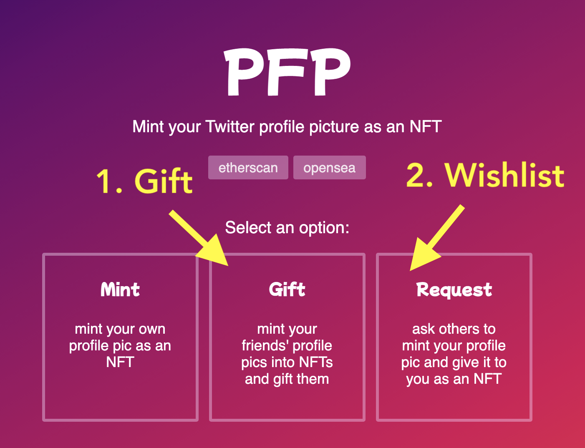

# Cell Tutorial

This document explains the Cell NFT Protocol and walks you through some tutorials to get you started in minutes.

> This tutorial assumes you have ZERO experience with blockchains or NFTs.
>
> As long as you know JavaScript and HTML, you should be able to follow along, deploy and mint NFTs.

1. **Concepts:** A quick overview of the Cell protocol stack
2. **Quickstart:** Follow the tutorial to launch your own NFT collection with simple JavaScript
3. **More Examples:** Even more tutorials with more examples
4. **More Info:** FAQ and links to API docs

---

# Concepts

Before we go in, here's a quick overview of the Cell framework stack.

## Cell

Cell is an NFT protocol. It is a new approach to creating and managing NFTs that is scalable, flexible, and completely removes trusted 3rd parties from the picture once and for all.

- **OWNERLESS**
  - No one owns the Cell protocol. No governance, no centralized upgrades. Every creator fully owns not just the contract, but also their entire UX. You don't have to use some company's service to make NFTs anymore. Cell is an **open public utility protocol**.
- **CREATE NFTS FOR FREE**
  - The only time you pay the gas fee is when you deploy the contract for the first time. From that point on, the creator gets to create as many tokens as they want for free. Only the minters pay gas for the minting.
- **NO TRUSTED 3RD PARTY**
  - Cell requires zero reliance on a trusted 3rd party to run. You don't **"join"** some website called "Cell" to create your tokens. Instead, think of it as an open source tool, just like Wordpress.

## Domain

**Cell NFTs can exist both onchain AND offchain.** When offchain tokens are recorded onto the blockchain through minting, they become "onchain tokens".

Tokens can ONLY be minted to the contracts they were created for. To enforce this, each token contains a piece of metadata made up of the following 3 attributes:

1. `address`: the contract address
2. `chainId`: the [chainId](https://chainlist.org/) used to describe the host blockchain (ex: 1 for Ethereum mainnet, 4 for Rinkeby)
3. `name`: the name of the contract specified when you deployed the NFT contract

**These 3 attributes are called a "domain" of a token.**

> When working with Cell NFT contracts, you will often need to provide the domain information to provide context around tokens.

Here's an example `domain`:

```json
{
  "address": "0x93f4f1e0dca38dd0d35305d57c601f829ee53b51",
  "chainId": 4,
  "name": "_test_"
}
```


## C0

`C0` is the first version (version 0) of the NFT contract for the Cell protocol. 

It can be deployed on any EVM compatible blocckhains. At the moment it is deployed on Ethereum:

- Mainnet: 
- Rinkeby: 

There may be more variations of the Cell protocol in the future.

## C0.js

`C0.js` is the JavaScript library that lets you:

1. **Create Tokens:** Create and sign tokens that can be eventually settled (minted) onto the `C0` contract on the blockchain.
2. **Mint Tokens:** Take the created tokens and post them to the `C0` contract on the blockchain.

## Nuron

Nuron is the software that lets you programmatically and automatically create tokens for the Cell protocol.

So why is Nuron needed?

1. **Automated tokenization:** To create an NFT collection with lots of tokens, we need a programmatic way to sign tokens. Nobody wants to sit there and manually sign 10,000 Metamask popups to create individual tokens. This is especially the case when we have a powerful protocol that lets you program each token individually, each with its own distinct logic. Cell is such a protocol, and to take advantage of all the features, we need an automated and flexible way to sign messages.
2. **IPFS that "just works":** One of the biggest hurdles when dealing with NFTs is IPFS. Everyone knows it's good to host NFT files on IPFS for provenance, but there isn't a simple way to manage and store files in a flexible way. For example, it's very tricky to manage IPFS files privately.

This is where "Nuron" comes in.

- **Wallet:** At the core of Nuron is a programmable wallet that can sign all kinds of messages automatically over RPC.
- **File System:** Additionally, Nuron includes a native file system that stores all the NFT related IPFS files locally as well as programmatically pin them to the global IPFS network whenever you want.
- **Database:** Finally, Nuron comes with a portable SQLite database that can store all your NFTs as well as their metadata, which is useful for sharing of pre-mint tokens WITHOUT relying on a trusted 3rd party.


## Nuron.js

Nuron.js is the JavaScript library that lets you programmatically interact with the Nuron software.

Because the Nuron interface is essentially an HTTP-based RPC endpoint, Nuron.js is an HTTP client that makes RPC requests to the local Nuron software and returns responses.

---

# Quickstart

Here are the next steps:

0. **Deploy contract:** Deploy the C0 contract.
1. **Setup nuron:** Install and setup Nuron, an app that lets you programmatically create and manage Cell NFTs.
2. **Create tokens:** Learn to use nuron.js to make requests to Nuron to create tokens.
3. **Manage tokens:** learn how the nuron file system stores and lets you browse and manage tokens.
4. **Mint tokens:** Learn how to publish the tokens and the built-in minting website, and mint from it./li>


---

## 0. Preparatioin

As the NFT creator, **the ONLY time you need to interact with the blockchain (and therefore need some coins) is WHEN YOU DEPLOY A CONTRACT.**

For deployment you need:

1. A wallet
2. Some coins

Let's take care of these first.

---

### 0.1. Get Wallet

You can use various wallets to deploy your contract, but let's use Metamask here since it's the most widely used:

<a class='btn' href="https://metamask.io/" target="_blank"> Go to Metamask Download</a>

---

### 0.2. Get Testnet Coins


In this tutorial we will launch the collection on Rinkeby, an Ethereum testnet. Let's get some testnet coins. 

Go to the following faucets to get Rinkeby coins for free:

1. https://faucets.chain.link/rinkeby
2. https://rinkebyfaucet.com/

---


## 1. Deploy Contract

### 1.1. Login to testnet account

Change your wallet network to Rinkeby and go to https://c0.cell.computer

You will see a website that looks like this:


Make sure that:

1. The top right corner says "Rinkeby"
2. You see the list of addresses

---

### 1.2. Cell computer home directory

Cell is a protocol but also a virtual computer. Just like most operating systems have a file system where all the files are stored under your home directory, Cell has a similar abstraction. The top most folder is the home directory.

The top row displays your **home** directory, which represents the currently logged-in blockchain (chainId) and the currently logged-in account (your address)


---

### 1.3. Contracts as subfolders

So what do the rest of the addresses represent?

The subfolders right below the home directory are your contracts. When you deploy your contracts, they will each be deployed at these addresses. This means you know the addresses of your contract even before you deploy them!


---

### 1.4. Deploy a contract

Now let's deploy one of the folders (contracts). 

Since all the folders are displayed upfront you can technically deploy any of them at any time.

However it is recommended that you **deploy them in order from the #0, to #1, to #2, in an incremental manner.** Otherwise it will be hard to keep track of which contracts you have deployed.

**Click the first row (contract #0)** to open the first folder (contract), and then enter the `name` and the `symbol` to deploy to the blockchain.

- `name`: The NFT collection name (The name that represents the collection, which will be displayed on NFT marketplaces and other platforms)
- `symbol`: The NFT collection symbol (not really used in case of NFTs so you can use anything)


Once the deployment transaction goes through, you will see the following screen where it displays [the domain of the deployed contract](#domain). Now we're ready to start printing some NFTs!:


---

## 2. Download Nuron

Nuron is a piece of software that lets you automatically and programmatically create tokens on any machine through an RPC interface.

---

### 2.1. Mac

Download on Mac:

<a class='btn' href="https://github.com/cell-org/nuron-desktop/releases/download/v0.0.5/nuron-0.0.5.dmg"><i class="fa-brands fa-apple"></i> Mac Installer</a>

---

### 2.2. Windows

Download on Windows:

<a class='btn' href="https://github.com/cell-org/nuron-desktop/releases/download/v0.0.5/nuron.Setup.0.0.5.exe"><i class="fa-brands fa-windows"></i> Windows Installer</a>

---

### 2.3. Linux

On Linux, we recommend using Docker to run Nuron. You need to install both [Docker](https://docs.docker.com/engine/install/) and [Docker Compose](https://docs.docker.com/compose/)

> You can also use the docker approach on Mac and Windows but for desktop settings it's much easier to just download the desktop apps.

#### A. Install Docker

First, install Docker by running the following commands ([Learn more](https://docs.docker.com/engine/install/ubuntu/#install-using-the-convenience-script))

```
curl -fsSL https://get.docker.com -o get-docker.sh
sudo sh get-docker.sh
```


#### B. Install Docker Compose

Next, install Docker Compose by running the following commands ([Learn more](https://docs.docker.com/compose/install/)):

```
sudo curl -L "https://github.com/docker/compose/releases/download/1.29.2/docker-compose-$(uname -s)-$(uname -m)" -o /usr/local/bin/docker-compose
sudo chmod +x /usr/local/bin/docker-compose
```

After the installation, check to make sure it's correctly installed:

```
docker-compose --version
```

It should print the current version.


#### C. Install and Run Nuron

To download and start Nuron, open the terminal and run the following command:

```
npx nuron start
```

This will automatically pull the docker image and start a container. run the following command to check that the container is running:

```
docker ps
```

You are all set to go if you see a Nuron container running:


---

## 3. Configure Nuron

You need to configure Nuron first. 

---

### 3.1. Mac & Windows

Open the Nuron app and you will see the following login screen:


#### Importing a Wallet

Currently there's no wallet connected to Nuron, so you will need to import a seed phrase.

> You must import **the wallet you used to deploy the Cell contract**.

Click "import a wallet" and you will see the following "import" page:


You can export your wallet seed phrase from other wallets (Example: [Metamask](https://metamask.zendesk.com/hc/en-us/articles/360015290032-How-to-reveal-your-Secret-Recovery-Phrase)) and paste it here.

Make sure to enter an account name to remember the wallet as, and enter a pass phrase to encrypt the wallet. The encrypted wallet will be stored locally on your machine (For maximum security, **EVERYTHING IN NURON HAPPENS ON YOUR LOCAL MACHINE**).

When you finish, Nuron will log you in and send you to the home screen:


#### Connecting to IPFS

Nuron currently uses [nft.storage](https://nft.storage) to pin your NFT files for free.

First go to nft.storage, get an account, and create an API key:


Now come back to Nuron, click the gear icon at the top right corner to go to the settings page:


And then click the **"workspace settings"** to go to the IPFS settings page. The API Key field will be empty. Copy and paste your NFT.STORAGE API Key here.


Now you're all ready to go!

---


### 3.2. Linux

On Linux, instead of using the web UI you can use the **Nuron CLI** to configure Nuron. Run the following command to connect to and configure Nuron:

```
npx nuron config
```

Make sure to configure both of the following:

1. **Import a wallet:** You MUST use the same address that deployed this contract. Export the seed phrase from the wallet you used to deploy this collection, and import it into Nuron./li>
2. **Configure IPFS:** Set the [nft.storage](https://nft.storage) IPFS config

#### Import a wallet

First, import your wallet seed phrase (or generate a new wallet):


#### Configure IPFS

Next, sign up to [nft.storage](https://nft.storage), get an API KEY, and store it into Nuron:


---

## 4. Create Tokens

Once Nuron is running on your machine, we are now all ready to go.

> **Create vs. Mint**
>
> One of the most important distinguishing factors of Cell is that, "creating" a token and "minting" a token are separate steps.
>
> This unbundling makes the engine ultra-flexible.
>
> **Example 1:** A collection creator may create 1000 tokens and publish them on a website, and minters may come to the site and "mint" them later.
>
> **Example 2:** A minter may request a collection creator to "create" a custom token. When the creator creates and returns the signed token to the minter, the minter can then "mint" it to the blockchain.
>
> **Example 3:** A collection creator may create a token privately and give it to someone privately WITHOUT publishing anywhere (through social media DMs, emails, text messages, etc). The receiver can then mint the token when they want.

---

### 4.1. Preview

With Cell, all you need to know is JavaScript code. All the complicated details are taken care of by Nuron, including:

1. managing and publishing IPFS files
2. signing cryptographic messages to create tokens that can be minted on the blockchain
3. creating minting sites and storefront sites

In this example we will create a **100 item generative avatar NFT collection with nothing but JavaScript, complete with a default storefront page and a minting page.** 

The storefront landing page will look like this:


And the minting page for each token will look like this:


---

### 4.2. Get the domain

Cell lets you print NFTs that can be potentially minted to ANY blockchain. Because of this flexibility, you need to define every token with a [domain](#domain) in order to describe where the tokens can be minted to.

- **GET THE DOMAIN:** Go to your Cell dashboard at https://c0.cell.computer and get the domain JSON for your deployed contract.


> **IMPORTANT**
>
> THIS PART IS IMPORTANT!!!!!
>
> Every code example in this document uses a demo domain. If you try to use them it won't work.
>
> You must **use your own domain**.

---

### 4.3. Create NFTs with JavaScript


First install all dependencies:

```
npm install nuronjs @dicebear/open-peeps @dicebear/avatars
```

Then create a file named `index.js`:

```javascript
const DOMAIN = <PASTE YOUR DOMAIN JSON OBJECT HERE>
const { createAvatar } = require('@dicebear/avatars');
const style = require('@dicebear/open-peeps');
const Nuron = require('nuronjs')
const nuron = new Nuron({
  key: "m'/44'/60'/0'/0/0",
  workspace: "open-peeps",
  domain: DOMAIN
});
(async () => {

  ////////////////////////////////////////////////////
  //
  // 0. CLEAN UP WORKSPACE (OPTIONAL)
  // if you want to start from clean slate
  // every time you run this code, remove everything
  // from the file system and the DB first.
  //
  ////////////////////////////////////////////////////

  // 0.1. Remove all files from the workspace "fs" folder
  await nuron.fs.rm("*")

  // 0.2. Remove all items from the token table
  await nuron.db.rm("token", {})

  // Loop 42 times and make avatars
  for(let i=0; i<42; i++) {

    ////////////////////////////////////////////////////
    //
    // 1. CREATE FILES (SVG + METADATA)
    //
    ////////////////////////////////////////////////////

    // 1.1. Generate the Avatar SVG
    let svg = createAvatar(style, { seed: i.toString() });

    // 1.2. Write the SVG to the file system
    let svg_cid = await nuron.fs.write(Buffer.from(svg))

    // 1.3. Write the NFT metadata to the file system
    let metadata_cid = await nuron.fs.write({
      name: `${i}`,
      description: `${i}.svg`,
      image: `ipfs://${svg_cid}`,
      mime: { [svg_cid]: "image/svg+xml" }  // to render the SVG with the correct mime type in the frontend
    })

    ////////////////////////////////////////////////////
    //
    // 2. CREATE A TOKEN AND WRITE TO NURON
    //
    ////////////////////////////////////////////////////

    // 2.1. Create a token from the metadata cid
    let token = await nuron.token.create({
      cid: metadata_cid
    })

    // 2.2. Write the token to the DB ("token" table)
    await nuron.db.write("token", token)

    // 2.3. Write the token to the file system
    await nuron.fs.write(token)

    ////////////////////////////////////////////////////
    //
    // 3. PIN ALL THE FILES (SVG + METADATA)
    //
    ////////////////////////////////////////////////////

    await nuron.fs.pin(svg_cid)
    await nuron.fs.pin(metadata_cid)

    console.log(`[${i}] created token`, token)
  }

  ////////////////////////////////////////////////////////////////
  //
  // 4. BUILD A BASIC COLLECTION WEBSITE (index.html + token.html)
  //
  ////////////////////////////////////////////////////////////////
  await nuron.web.build()
  console.log("finished")
})();
```

Run the code:

```
node index
```

Above code takes care of everything you need for an NFT collection, including:

1. Store files locally
2. Create tokens locally
3. Publish all the files to the global IPFS network (pinning)

All that's left now is to to publish the tokens to the web so people can mint them.

> To learn how to actually publish the NFTs and the storefront website, skip to the next section "Browse and Manage Tokens"

---

## 5. Manage Tokens

Any signed token can be submitted to the blockchain to be minted. To mint tokens, we will use `c0.js`, a library that lets you interact with the Cell C0 contract on the blockchain.

---

### 5.1. Where is everything stored?

So where are all the files stored? Run the following command to find out:

```
npx nuron home
```

Open the folder with Finder (mac) or Explorer (windows) or ls (linux) and you will see all the files you've just created.


```
<YOUR_HOME_DIRECTORY>
│
└── __nuron__
    └── v0
        └── home
            ├── config.json
            └── workspace
                │
                ├── <WORKSPACE 1>
                │   ├── db
                │   │   └── mixtape.db
                │   ├── fs
                │   │   ├── <IPFS file 0>
                │   │   ├── <IPFS file 1>
                │   │   ├── <IPFS file 2>
                │   │   ├── . . .
                │   │   └── <IPFS file n>
                │   └── web
                │       ├── index.html
                │       └── token.html
                │
                └── <WORKSPACE 2>
                    ├── db
                    │   └── mixtape.db
                    ├── fs
                    │   ├── <IPFS file 0>
                    │   ├── <IPFS file 1>
                    │   ├── <IPFS file 2>
                    │   ├── . . .
                    │   └── <IPFS file n>
                    └── web
                        ├── index.html
                        └── token.html
```

- `db`: the db folder
  - `db/mixtape.db`: stores all the token JSON in sqlite, so they can be queried in realtime, but also shared easily in a single file
- `fs`: the fs folder stores all the files (including the asset files, metadata files, and even the token files) under the IPFS names WITHOUT publishing anything to the global IPFS network. You will need to pin these files to IPFS if you want them to be public at some point.
- `web`: the website folder
  - `index.html`: the main page that displays all the tokens under the folder. It loads the `mixtape.db` database once when the page loads, and queries the in-browser DB to load tokens and render them.
  - `token.html`: the page used to render and mint the tokens.

---

### 5.2. Mac & Windows

On Mac and Windows, the Nuron app lets you navigate the Nuron file system, as well as acting as a built-in local web server that lets you easily preview the generated NFT website easily.

#### Navigating Workspaces

A "workspace" is just a local folder.

- You can create as many workspaces as you want.
- You can even create multiple workspaces for one contract.
- The workspace name is 100% local and it's only for your organization purpose. You can name them whatever you want, the workspace name won't show up on chain.

To navigate your workspaces:

1. Login to Nuron. Select `workspaces`.
2. You will see all your workspaces here (it will be empty if you didn't create one yet. you can programmatically create workspaces by following the tutorial example above)
3. Select the workspace you want to navigate and click around.


#### Previewing Websites

If you generated the website using the `nuron.web.build()` command, you will see a `web` folder in your workspace. (This is optional, so if you didn't generate a website, you won't see the web folder).

Nuron has a built-in web server that lets you preview these sites easily.

1. From Nuron, go to the `web` folder in your workspace. You will see `index.html` and `token.html`
3. Open the `index.html` file. It will open your default browser and load the `index.html` file in it.


---

### 5.3. Linux

#### Navigating Workspaces

In Linux we are going to use the terminal to navigate and preview these files.

Let's first check which workspaces the Nuron file system contains. From your terminal, enter the following command:

```
npx nuron ls
```

It will print all the workspaces created so far (it will be empty if there are none).

Now let's actually go to the folder where all the files are stored. First find out the Nuron file system path:

```
npx nuron home
```

This will print the local folder where all the Nuron files are stored. Let's say the folder was `/Users/Alice/__nuron__/v0/home`, let's change directory:

```
cd /Users/Alice/__nuron__/v0/home
```

You will see there is a `config.json` file and a `workspace` folder. Go into the workspace folder:

```
cd workspace
```

This is where all the files are stored. Feel free to navigate them more to understand the folder structure.


#### Previewing Websites

Remember we called the `nuron.web.build()` method in the creation code? This was what created the `web/index.html` and `web/token.html` files.

1. `web/index.html`: creates the storefront homepage
2. `web/token.html`: creates the landing page that renders each token individually

> You don't have to use these auto-generated pages. They are just provided for convenience.


This will list all the folders. We want to start a local HTTP server for one of the folders, in this case `_test_`:


```
npx nuron serve _test_
```

This command internally uses HTTP-SERVER module to serve local files from a local web server. The terminal will look something like this:

```
Starting up http-server, serving /root/_nuron/home/fs/open-peeps

http-server version: 14.1.0

http-server settings:
CORS: disabled
Cache: 3600 seconds
Connection Timeout: 120 seconds
Directory Listings: visible
AutoIndex: visible
Serve GZIP Files: false
Serve Brotli Files: false
Default File Extension: none

Available on:
  http://127.0.0.1:8080
  http://165.22.187.55:8080
  http://10.10.0.15:8080
  http://172.17.0.1:8080
  http://172.28.0.1:8080
Hit CTRL-C to stop the server
```

Let's test now. Open the server URL in the browser (for this example it's http://127.0.0.1:8080/web), and you will see the storefront landing page.

For the generative avatar example, it will look something like this:


#### Testing Publicly (advanced)

The problem (or benefit, depending on what you're trying to do) with the local test is that **ONLY YOU can access the website**, since you're loading the website from your own local machine. No one else can just type in http://127.0.0.1:8080/web from their machines and access your website.

While testing, you may often want to have a temporary REAL URL that anyone else can access (such as https://fluffy-hound-53.loca.lt/), so you can privately test with your friends or colleagues. Some possible scenarios:

1. **Private sharing:** Quickly share the minting page with a small group of people who have the URL
2. **Test on a remote linux machine:** If you're running Nuron on a remote linux machine (like Digitalocean), you can't just type in http://127.0.0.1:8080/web in your browser to access the website because the http://127.0.0.1:8080/web on your machine is your own machine, not the remote linux machine.

To solve this problem, you can set up a temporary public URL that connects to the instant HTTP server you created with `nuron serve [folder]`. Just get the port number from the `nuron serve` (let's assume the port is 8080/web in this case) and run the following command, which creates a public URL "tunnel" that connects to the local IP:

```
npx nuron tunnel 8080
```

It will start a tunnel and print the public URL you can use, for example:

```
Tunnel created:  https://fluffy-hound-53.loca.lt
```

> Nuron makes use of the free [Localtunnel service](https://theboroer.github.io/localtunnel-www/) to handle tunneling.

---

## 6. Publishing the Minting Site

The Cell protocol has been carefully designed to remove centralization points. By default everything works as a static website, with no centralized database running somewhere in the cloud.

Everything is packaged in a way that should "just work". So how do we publish this thing and allow people to mint?

---

### 6.1. Find the local workspace folder

You can find the workspace folder by following the instructions in [this section](#navigating-workspaces-1).

The `npx` commands work identically on all platforms including Mac, Windows, and Linux.

---


### 6.2. Publish the folder to the web

1. **Basic:** Just dump the entire collection folder onto your web hosting provider, and it should just work. For example if everything is stored under /root/_nuron/home/fs/open-peeps, you simply copy and paste that entire open-peeps folder into whichever web hosting provider you use, and it should work instantly.
2. **GitHub Pages:** Every folder in the Nuron file system is a git repository, and was designed to work right out of the box with no additional configuration. You can publish your NFT collection to the web for free using GitHub pages. To use GitHub pages, you can:
    1. download [GitHub Desktop](https://desktop.github.com/) and login with your GitHub account
    2. Add your NFT collection folder (example: `/root/_nuron/home/fs/open-peeps`), commit, and publish to GitHub
    3. Go to GitHub and [turn on GitHub pages](https://docs.github.com/en/pages/getting-started-with-github-pages/configuring-a-publishing-source-for-your-github-pages-site) for your repository

---

## 7. Minting Tokens

Once you publish the tokens to a website, you're pretty much done. Anyone can now come and mint the tokens they have the permission to.

> With Cell, each token can be individually programmed to have different minting conditions and traits from one another, such as royalty, expiration time, start time, price, hash puzzle, membership, etc.

---

### 7.1. Mint from the storefront

The included `index.html` and `token.html` are enough to let people mint directly from the website. Before moving forward, try minting from the site.

---

### 7.2. c0.js

You need to use [c0.js](https://c0js.cell.computer) to interact with the Cell C0 contract. The built-in web pages (`index.html` and `token.html`) both make use of the `c0.js` library to achieve this as well.

To learn more about how to use `c0.js`, check out the documentation: https://c0js.cell.computer

---

## 8. Launch in production mode

So far we've used the testnet.

But it is very simple to deploy the exact same contract to the mainnet. Here's what you need to do:

---

### 8.1. Switch to mainnet

Switch your browser wallet to mainnet and refresh the Cell computer dashboard at https://c0.cell.computer

---

### 8.2. Check the mainnet connection

From the dashboard, check to make sure that the top right corner says "mainnet"


---

### 8.3. Deploy to mainnet

ollow the same steps as we did with the [testnet deployment](#_04-deploy-a-contract). Only this time, it will simply deploy the contract to the mainnet, and once it's deployed you'll see that the contract domain has a chainId of "1":


---

# More Examples

## 1. Turn web images into NFT

First install all dependencies:

```
npm install nuronjs axios
```

Then create a file named index.js:


```javascript
const DOMAIN = <PASTE YOUR DOMAIN JSON OBJECT HERE>
const Nuron = require('nuronjs');
const axios = require('axios');
const nuron = new Nuron({
  key: "m'/44'/60'/0'/0/0",
  workspace: "this_cat",
  domain: DOMAIN
});
(async () => {

  ////////////////////////////////////////////////////
  //
  // 0. CLEAN UP WORKSPACE (OPTIONAL)
  // if you want to start from clean slate
  // every time you run this code, remove everything
  // from the file system and the DB first.
  //
  ////////////////////////////////////////////////////

  // 0.1. Remove all files from the workspace "fs" folder
  await nuron.fs.rm("*")

  // 0.2. Remove all items from the token table
  await nuron.db.rm("token", {})

  let cids = []

  // creating 100 tokens
  for(let i=0; i<100; i++) {

    ////////////////////////////////////////////////////
    //
    // 1. FETCH A REMOTE IMAGE AND WRITE TO NURON
    //
    ////////////////////////////////////////////////////
    
    // 1.1. Fetch web image
    const image = await axios({ url: "https://thiscatdoesnotexist.com/", method: "GET", responseType: 'arraybuffer' }).then((r) => { return r.data })

    // 1.2. Write the image buffer to the file system
    const cid = await nuron.fs.write(image)

    // 1.3. Write a metadata object to the file system
    const metacid = await nuron.fs.write({
      name: i,
      description: i,
      image: "ipfs://" + cid,
    })

    ////////////////////////////////////////////////////
    //
    // 2. CREATE A TOKEN AND WRITE TO NURON
    //
    ////////////////////////////////////////////////////
    
    // 2.1. Create a token (PRICE 0)
    const token = await nuron.token.create({
      cid: metacid,
      price: 0
    })

    // 2.2. Write the token to the DB
    await nuron.db.write("token", token)

    // 2.3. Write the token to the file system
    const tokencid = await nuron.fs.write(token)

    // 2.4. Store all the IPFS CIDs in an array so we can pin them all later in bulk
    cids.push(cid)
    cids.push(metacid)
  }

  ////////////////////////////////////////////////////
  //
  // 3. PIN ALL THE FILES
  //
  ////////////////////////////////////////////////////

  for(let i=0; i<cids.length; i++) {
    let res = await nuron.fs.pin(cids[i])
    console.log("pinned", i, "of", cids.length, res)
  }

  ////////////////////////////////////////////////////////////////
  //
  // 4. BUILD A BASIC COLLECTION WEBSITE (index.html + token.html)
  //
  ////////////////////////////////////////////////////////////////
  await nuron.web.build();

})();
```

Run the code:

```
node index
```

Above code takes care of everything you need for an NFT collection, including:

1. Store files locally
2. Create tokens locally
3. Publish all the files to the global IPFS network (pinning)

All that's left now is to to publish the tokens to the web so people can mint them.

> To learn how to actually publish the NFTs and the storefront website, skip to the next section "Browse and Manage Tokens"

---


## 2. Turn your local folder into NFTs

First install all dependencies:

```
npm install nuronjs
```

Then create a file named index.js:


```javascript
const DOMAIN = <PASTE YOUR DOMAIN JSON OBJECT HERE>
const fs = require('fs')
const path = require('path')
const Nuron = require('nuronjs');
const nuron = new Nuron({
  key: "m'/44'/60'/0'/0/0",
  workspace: "tokenized_images",
  domain: DOMAIN
});
const tokenize = async (folder) => {

  ////////////////////////////////////////////////////
  //
  // 0. CLEAN UP WORKSPACE (OPTIONAL)
  // if you want to start from clean slate
  // every time you run this code, remove everything
  // from the file system and the DB first.
  //
  ////////////////////////////////////////////////////

  // 0.1. Remove all files from the workspace "fs" folder
  await nuron.fs.rm("*")

  // 0.2. Remove all items from the token table
  await nuron.db.rm("token", {})

  ////////////////////////////////////////////////////////////
  //
  // 1. READ ALL FILES IN THE FOLDER AND LOOP THROUGH THEM ALL
  //
  ////////////////////////////////////////////////////////////
  // get all files under the "folder" location
  const files = await fs.promises.readdir(folder)
  // loop through all the filenames
  for(let file of files) {

    ////////////////////////////////////////////////////////
    //
    // 2. READ ALL FILES IN THE FOLDER AND WRITE TO NURON
    //
    ////////////////////////////////////////////////////////

    // 2.1. Read a file
    const buf = await fs.promises.readFile(path.resolve(folder, file))

    // 2.2. Write the file buffer to nuron file system
    const cid = await nuron.fs.write(buf)

    // 2.3. Write an NFT metadata to the nuron file system
    const metacid = await nuron.fs.write({
      name: file,
      image: "ipfs://" + cid,
    })

    ////////////////////////////////////////////////////////
    //
    // 3. CREATE A TOKEN FROM THE METADATA IPFS CID
    //
    ////////////////////////////////////////////////////////

    // 3.1. Create a token
    const token = await nuron.token.create({
      cid: metacid,
      price: 0
    })

    // 3.2. Write the token to the nuron file system
    await nuron.fs.write(token)

    // 3.3. Write the token to the nuron DB "token" table
    await nuron.db.write("token", token)

    ////////////////////////////////////////////////////////////////
    //
    // 4. PIN ALL THE FILES (both the metadata and the original file
    //
    ////////////////////////////////////////////////////////////////

    // 4.1. Pin the original file
    await nuron.fs.pin(cid)

    // 4.2. Pin the metadata file
    await nuron.fs.pin(metacid)

  }
  ////////////////////////////////////////////////////////////////
  //
  // 5. BUILD A BASIC COLLECTION WEBSITE (index.html + token.html)
  //
  ////////////////////////////////////////////////////////////////
  await nuron.web.build();

}

// take the command line folder argument and tokenize all images under that folder
tokenize(process.argv[2])
```

Run the code:

```
node index [IMAGE_FOLDER_PATH]
```

Above code takes care of everything you need for an NFT collection, including:

1. Store files locally
2. Create tokens locally
3. Publish all the files to the global IPFS network (pinning)

All that's left now is to to publish the tokens to the web so people can mint them.

> To learn how to actually publish the NFTs and the storefront website, read the next section "Manage Tokens"

---

## 3. Turn multimedia files into NFTs

Most NFT marketplaces support a metadata attribute called `animation_url`. 

> You can learn more about the `animation_url` attribute here: https://docs.opensea.io/docs/metadata-standards#metadata-structure

If you are trying to tokenize non-image files, you will need to:

1. set the `animation_url` with your multimedia file CID
2. generate a thumbnail
3. set the `image` attribute with the thumbnail CID
4. Pin the **metadata file**, **multimedia file**, and the **thumbnail file** to IPFS.

Here's an example that does this.

### 3.1. Setup

We are going to use a library called [pngenerator](https://github.com/parweb/pngenerator) here (but you can generate thumbnails using any library you want).

Note that you may have to install some binaries before using this library.

- **unoconv**
  - **linux:** `apt-get install unoconv`
  - **mac:**: `brew install unoconv`
  - **windows:** https://docs.moodle.org/400/en/Universal_Office_Converter_(unoconv)#Installing_unoconv_on_Windows
- **ffmpeg:**
  - **linux:** `apt-get install ffmpeg`
  - **mac:** `brew install ffmpeg`
  - **windows:** https://ffmpeg.org/download.html#build-windows
- **imagemagick**
  - **linux:** `apt-get install imagemagick`
  - **mac:** `brew install imagemagick`
  - **windows:** https://imagemagick.org/script/download.php#windows


### 3.2. Code

The multimedia tokenization is pretty much the same except for the following differences:

1. **thumbnail():** A method to convert multimedia files into image thumbnails, write them to nuron file system, and return their IPFS CIDs
2. **animation_url:** Set the CID of the multimedia file as the `animation_url` attribute for the metadata
3. **image:** The `image` attribute is now set as the thumbnail image's IPFS CID, returned from the `thumbnail()` method.

Also, don't forget to pin all of the following:

1. The multimedia file
2. The thumbnail image file
3. The metadata file

```javascript
const DOMAIN = <PASTE YOUR DOMAIN JSON OBJECT HERE>
const pngenerator = require('pngenerator');
const fs = require('fs')
const Nuron = require('nuronjs')
const nuron = new Nuron({
  key: "m'/44'/60'/0'/0/0",
  workspace: "multimedia",
  domain: DOMAIN
});
// Thumbnail generator
// using the "pngenerator" package
// https://github.com/parweb/pngenerator
const thumbnail = async (file) => {
  const { fileTypeFromFile } = await import('file-type');
  let filepath = `files/${file}`
  let type = await fileTypeFromFile(filepath)
  let thumb_cid;
  // image type => just use the image
  if (type.mime.startsWith("image")) {
    thumb_cid = cid
  }
  // not image type => generate thumbnail from the file
  else {
    let destinationFilepath = `tmp-${file}.png`
    await new Promise((resolve, reject) => {
      pngenerator.generate(filepath, destinationFilepath, (err) => {
        // can't generate a preview => just use the default placeholder image
        if (err) {
          fs.promises.copyFile("placeholder.png", destinationFilepath).then(() => {
            resolve()
          })
        }
        // successfully generated thumbnail => return
        else {
          resolve()
        }
      })
    })
    // add the generated file to nuron file system
    let tmpBuffer = await fs.promises.readFile(destinationFilepath)
    thumb_cid = await nuron.fs.write(tmpBuffer)
    // remove the generated file from local file system since
    // we only need the file to be added to nuron
    await fs.promises.rm(destinationFilepath)
  }
  return {
    type: type,
    thumb_cid: thumb_cid
  };
}


(async () => {
  ////////////////////////////////////////////////////
  //
  // 0. CLEAN UP WORKSPACE (OPTIONAL)
  // if you want to start from clean slate
  // every time you run this code, remove everything
  // from the file system and the DB first.
  //
  ////////////////////////////////////////////////////

  // 0.1. Remove all files from the workspace "fs" folder
  await nuron.fs.rm("*")

  // 0.2. Remove all items from the token table
  await nuron.db.rm("token", {})

  let files = await fs.promises.readdir("files")
  for(let file of files) {
    let filepath = `files/${file}`
    let buf = await fs.promises.readFile(filepath)
    let cid = await nuron.fs.write(buf)

    // generate thumbnail and get its cid
    let { type, thumb_cid } = await thumbnail(file)

    let metadata_cid = await nuron.fs.write({
      name: file,
      description: file,
      image: `ipfs://${thumb_cid}`,     // use the thumbnail image cid as the image
      animation_url: `ipfs://${cid}`,   // the original filea url should be the animation_url
      mime: { [cid]: type.mime }        // needed to efficiently render the files on the minting page
    })

    // create a token script
    let token = await nuron.token.create({
      cid: metadata_cid,
    })
    console.log(`[${file}] created token`, token)

    // write the token to nuron db
    await nuron.db.write("token", token)

    // write the token to the nuron file system
    await nuron.fs.write(token)

    // pin the original file to IPFS
    console.log("pinning file...", cid)
    await nuron.fs.pin(cid)

    // pin the thumbnail file to IPFS
    console.log("pinning thumbnail file...", thumb_cid)
    await nuron.fs.pin(thumb_cid)

    // pin the metadata file to IPFS
    console.log("pinning metadata...", metadata_cid)
    await nuron.fs.pin(metadata_cid)
  }

  ////////////////////////////////////////////////////////////////
  //
  // 4. BUILD A BASIC COLLECTION WEBSITE (index.html + token.html)
  //
  ////////////////////////////////////////////////////////////////
  await nuron.web.build()
  console.log("finished")
})();
```

### 3.3. Check out the minting site

Now open your Nuron workspace and go into the `web` folder and open the `index.html`. You will see something like this:


---


## 4. On-demand NFTs

This documentation mostly discussed how to create all tokens BEFOREHAND, and let people mint from the created tokens published to the web.

However, one of the biggest benefits of the Cell protocol approach is that the **creating and minting of a token are unbundled and exist as separate steps**, which means you can create tokens on one machine, and mint them on another machine. This lets us easiliy implement on-demand minting apps.

For example, let's say you wanted to build something like the [Canvas NFT](https://canvas.papercorp.org/), where the users can customize what they want to mint. You can achieve this by:

1. create a web app server (for example using [express.js](https://expressjs.com/))
2. let people do whatever they want on the frontend side, and send a POST request with a desired payload
3. your server side logic can call the `nuron.token.create()` to create custom tokens requested by the frontend
4. the server can then return the created token to the frontend as the request response
5. the user can then take that JSON (signed token object) and mint it.

Let's take the `open-peeps` generative avatar example from above, and turn it into an on-demand minting app.

First, create a new project folder and install all the dependencies:

```
npm install @dicebear/avatars @dicebear/open-peeps express nuronjs
```

Now create a file named `index.js`:

```javascript
const DOMAIN = <PASTE YOUR DOMAIN JSON OBJECT HERE>
const { createAvatar } = require('@dicebear/avatars');
const style = require('@dicebear/open-peeps');
const Nuron = require('nuronjs')
const express = require('express')
const nuron = new Nuron({
  key: "m'/44'/60'/0'/0/0",
  workspace: "open-peeps",
  domain: DOMAIN
});
const app = express()
app.use(express.urlencoded({ extended: true }))
app.use(express.json())
app.get("/", (req, res) => {
  res.sendFile(__dirname + "/index.html")
})
app.post("/create", async (req, res) => {

  // 1. generate svg
  let svg = createAvatar(style, { seed: req.body.seed });

  // 2. write the svg to the nuron file system and get its IPFS cid
  let svg_cid = await nuron.fs.write(Buffer.from(svg))

  // 3. write the metadata to the nuron file system and get its IPFS cid
  let metadata_cid = await nuron.fs.write({
    name: req.body.seed,
    description: `${req.body.seed}.svg`,
    image: `ipfs://${svg_cid}`,
    mime: { [svg_cid]: "image/svg+xml" }
  })

  // 4. create a token from the metadata cid
  let token = await nuron.token.create({
    cid: metadata_cid
  })

  // 5. pin all the files (both svg and metadata)
  await nuron.fs.pin(svg_cid)
  await nuron.fs.pin(metadata_cid)

  // 6. return the created token as response. the user will take this token and mint it from the frontend
  res.json({
    token: token,
    svg: svg
  })
})
app.listen(3000)
```

Above code basically sets up an express.js server and when a `POST /create` request is made, it creates a token and returns it back to the frontend along with the SVG.

> **NOTE #1**
>
> Notice that in this example we are not using the `nuron.db.write()` method to store the tokens to the DB.
>
> This is because we are assuming that the user will receive the token as the request response from the frontend and **immediately mint it to the blockchain**.
>
> You only need to store to DB if you need some way to store all the tokens so they can be minted later.

> **NOTE #2**
>
> Even though we're not using the nuron DB in this example, we still need to use the **file system** by writing to it with the `nuron.fs.write()` API, because only then you can pin the nuron files to the public IPFS network using `nuron.fs.pin()`

Now we need the frontend page. Create a file named `index.html` in the same folder:


```html
<html>
<head>
<script src="https://cdnjs.cloudflare.com/ajax/libs/web3/1.7.1-rc.0/web3.min.js"></script>
<script src="https://unpkg.com/c0js/dist/c0.js"></script>
</head>
<body>
<form>
<input type='text' id='seed'>
<input type='submit' value='create'>
</form>
<div id='svg'></div>
<div id='tokens'>
</div>
<script>
document.querySelector("form").addEventListener("submit", async (e) => {
  e.preventDefault()
  e.stopPropagation()
  // initialize c0 with the browser web3 instance
  const web3 = new Web3(window.ethereum);
  const c0 = new C0()
  await c0.init({ web3: web3 })
  // call "POST /create" endpoint to generate a token
  let response = await fetch("/create", {
    method: "POST",
    headers: { "Content-Type": "application/json" },
    body: JSON.stringify({ seed: document.querySelector("#seed").value })
  }).then((res) => {
    return res.json()
  })
  let svg = response.svg
  let token = response.token
  document.querySelector("#svg").innerHTML = svg
  // create a mint transaction with one token
  let tx = await c0.token.send([token])
  let address = token.domain.verifyingContract
  let tokenId = token.body.id
  if (token.domain.chainId == 4) {
    // rinkeby
    document.querySelector("#tokens").innerHTML = `<div class='markets'>
  <a href="https://testnets.opensea.io/assets/${address}/${tokenId}">Opensea</a>
  <a href="https://rinkeby.rarible.com/token/${address}:${tokenId}">Rarible</a>
</div>`
  } else {
    // mainnet
    document.querySelector("#tokens").innerHTML = `<div class='markets'>
  <a href="https://opensea.io/assets/${address}/${tokenId}">Opensea</a>
  <a href="https://rarible.com/token/${address}:${tokenId}">Rarible</a>
</div>`
  }
})
</script>
</body>
</html>
```

Now start the server and go to http://localhost:3000:

```
node index
```

The entire minting app will look something like this:


---


## 5. On-demand NFTs in Production

When you implement an on-demand NFT server, your server is basically acting as a token printer:

1. Users ask the token printer to print some tokens
2. Users take the printed token and mint it to the blockchain
3. Now the tokens are on-chain and your token printer's job is done

You as the token printer's job is ONLY to print tokens so they can be minted on chain. From that point on, the tokens follow the rule of the host blockchain and you are no longer needed (you are not the central point of failure).

This means that the only part where things may fail is your token printing step. If the token printer server shuts down or crashes, the users won't be able to ask your printer to give them tokens to mint.

To avoid this situation, you should program your on-demand token server so that it automatically restarts when something goes wrong and it crashes, so it always stays up.

There are two parts to this:

1. Nuron
2. Token Printer App

---

### 5.1. Nuron

When using Nuron in a server setting, you should be using the Docker version of Nuron (instead of desktop Nuron).

The Dockerized Nuron is managed with a docker-compose file that looks like this:

```yaml
version: "3.9"
services:
  nuron:
    image: skogard/nuron
    restart: always
    volumes:
      - type: bind
        source: ${HOME}/__nuron__/v0
        target: /usr/src/app/__nuron__/v0
      - type: bind
        source: ${HOME}/.keyport
        target: /usr/src/app/__keyport__
    ports:
      - "42000:42000"
```

The `restart: always` means the container will always restart when it crashes. Therefore when using the Dockerized Nuron, **you don't have to worry about Nuron's resiliency. It just works.**

---

### 5.2. Your ondemand NFT app

While Nuron itself can automatically restart, we still have one more issue.

Whenever Nuron restarts, it clears out all the connections, which means all the clients previously connected to Nuron will lose connection and they will need to re-connect.

To handle this, you can use the [nuron.js wallet.connect() API](https://nuronjs.cell.computer/#/?id=connect) to connect at the beginning of your token printer server initialization.

#### Initial Login

Let's quickly revisit the on-demand NFT express app from the previous section. Whenever we start this app, we can programmatically connect to Nuron using [nuron.wallet.connect()](https://nuronjs.cell.computer/#/?id=connect).

```javascript
const DOMAIN = <PASTE YOUR DOMAIN JSON OBJECT HERE>
const { createAvatar } = require('@dicebear/avatars');
const style = require('@dicebear/open-peeps');
const Nuron = require('nuronjs')
const express = require('express')
const nuron = new Nuron({
  key: "m'/44'/60'/0'/0/0",
  workspace: "open-peeps",
  domain: DOMAIN
});

////////////////////////////////////////////////
//
// CONNECT TO NURON USING THE
// WALLET USERNAME AND THE ENCRYPTION PASSWORD
// SET THROUGH "npx nuron config"!
//
////////////////////////////////////////////////
nuron.wallet.connect(WALLET_PASSWORD, WALLET_USERNAME)

...

```

By connecting at the beginning of your app's launch, you can esure that this app will connect to your desired Nuron account.

#### Reconnect on exception

Now that we know how to connect at the beginning, how do we make sure it's always connected? For example if Nuron crashes and restarts, or for some reason the connection is destroyed?

We can think about two different approaches:

1. **Handle exception:** handle exception in the app 
2. **Crash and restart:** just let the app crash, but run the app itself in a Docker container or in a process manager like [PM2](https://pm2.keymetrics.io/)

##### A. Handle exception in the app

For example, you

```javascript
const createToken = async (svg) => {
  try {
    // Try to write to nuron
    let svg_cid = await nuron.fs.write(Buffer.from(svg))
    . . .
  } catch (e) {
    // if it fails, try connecting to nuron and call createToken() again
    await nuron.wallet.connect(PASSWORD, USERNAME)
    await createToken(svg)
  }
}
```

##### B. Let the app crash and auto-restart on exception

Another approach is simply let the exception crash the app and let the app itself automatically restart. That way, the initial connection logic will kick in when the app restarts, and your app will be always connected.

To take this approach, you don't need to change the existing code. The code will simply crash when it tries to write to Nuron when the session has been disconnected. You just need to run the app itself in a way that can auto-restart. For example:

1. **Process manager:** run your node.js app in a process management engine like [PM2](https://pm2.keymetrics.io/)
2. **Container:** or containerize your app itself in a Docker container and run it with a `restart: always` policy

---

## 6. Value lock

You can restrict the NFT minting based on how much ETH is attached to the minting transaction.

### 6.1. NFTs with dynamic minting price

Let's say you want to create a token whose minting price goes down over time. To facilitate this, you can create multiple Scripts for the same token:

```javascript
const today = Math.floor(Date.now() / 1000)
let today = await nuron.token.create({
  cid: metadata_cid,
  start: today,
  end: today + 24 * 60 * 60 - 1,
  value: 10 ** 18
})
let tomorrow = await nuron.token.create({
  cid: metadata_cid,
  start: today + 24 * 60 * 60,
  value: 10 ** 17
})
```

- The `today` script can be submitted to the blockchain starting right now, until 24 hours later (24 * 60 * 60 seconds), at the price of 10**18 wei (1 ETH)
- The `tomorrow` script can be submitted to the blockchain starting 24 hours later, at the price of 10**17 wei (0.1ETH)

---

### 6.2. Market Segmentation

You can create multiple minting conditions for the same tokenid.

- Provide discounted rate for some.
- Provide free mint for some.
- Provide higher rate for others.
- Combine with multiple other locks for sophisticated authorization

For example, imagine creating 3 simultaneous scripts for the SAME token `metadata_cid`:

```javascript
let publicAudience = await nuron.token.create({
  cid: metadata_cid,
  value: 10 ** 18                                   // anyone can mint for 1ETH
})
let puzzleSolver = await nuron.token.create({
  cid: metadata_cid,
  puzzle: "3.1415926535897932384626433832795028841971693993751",
  value: 0                                          // whoever solves this puzzle can mint for FREE
})
let friends = await nuron.token.create({
  cid: metadata_cid,
  senders: [
    friend0_address,
    friend1_address,
    friend2_address,
    friend3_address,
  ],
  value: 10 ** 16                                   // friends can mint for 0.01ETH
})
```

You can publish all of these scripts simultaneously, or selectively or privately. And the first account to mint gets the NFT.

---

## 7. Hash puzzle lock

You can create tokens that can only be minted when the minter knows the code you locked the script with. 

### 7.1. Create a puzzle protected token

For example, let's create a script that can only be minted into an NFT when you supply the string "magic word".

```javascript
let script = await nuron.token.create({
  cid: metadata_cid,
  puzzle: "magic word"
})
console.log("CREATED SCRIPT = ", script)
```

This will create a token script that looks like this:

```javascript
CREATED SCRIPT = {
  body: {
    signature: '0xaf7a5e68df3417bfcc0d4155d7f1a15d8d8a8656eb72147cffb7c6df72fff93f2f7ce6c157c50419337c63c510a1cf78398d15d24b1ca33df9db1f73d2f38c7a1b',
    cid: 'bafkreiecoogmguhvhvslpait4kknvmic5344dgvrs3l5migok5aj33pcei',
    id: '59004829238478164602790103135035438545739640263958690554266001662053689713186',
    encoding: 0,
    sender: '0x0000000000000000000000000000000000000000',
    receiver: '0x0000000000000000000000000000000000000000',
    value: '0',
    start: '0',
    end: '18446744073709551615',
    relations: [],
    senders: [],
    sendersHash: '0x0000000000000000000000000000000000000000000000000000000000000000',
    receivers: [],
    receiversHash: '0x0000000000000000000000000000000000000000000000000000000000000000',
    puzzleHash: '0xf6eadd29a1811cb6d151eab8645fae31b713575726deacfb0c8ebe6677ecb33e'
  },
  domain: {
    name: '_test_',
    chainId: 4,
    verifyingContract: '0x93f4f1e0dca38dd0d35305d57c601f829ee53b51',
    version: '1'
  }
}
```

Note that there is no `"magic word"` secret code included anywhere (It would beat the whole purpose if the raw code were directly included in the script). Instead, the string has been hashed and stored as `puzzleHash: "0xf6eadd29a1811cb6d151eab8645fae31b713575726deacfb0c8ebe6677ecb33e"`. The minter will have to supply the solution `"magic word"` when submitting the script to the blockchain, which we will take a look below.

### 7.2. Solve the puzzle to mint

Now let's put on our "minter role" hat and try to mint this token script by providing the `"magic word"` and submitting to the blockchain:

```javascript
let tx = await c0.token.send([script], [{ puzzle: "magic word" }])
```

What this does is:

1. The second argument `[{ puzzle: "magic word" }]` is passed into the c0.js library
2. c0.js passes "magic word" to the C0 contract when submitting the minting transaction
3. The c0 contract hashes the "magic word" and compares the `token.body.puzzleHash` with the hash of the "magic word", and if they match, the token is minted.

> Note that we are using the c0.js library here, not nuron.js.
>
> The nuron.js library is used for automatically printing (creating) tokens, but not for minting (Nuron was deliberately designed to NEVER connect to the blockchain for security reasons).
>
> The c0.js library is used for interacting with the blockchain.

---

## 8. Address lock

You can restrict minting based on minter or receiver addresses.

### 8.1. Minter address lock

Cell lets you program **who can mint a token** directly into a script. Each token can be individually programmed differently.

> **Note**
>
> In most NFT contracts, "minting" means the minter will receive the minted token.
>
> However with Cell, the "minter" and the "receiver" roles are decoupled and separately programmable, which means you can program who can mint and who can receive, separately.
>
> To learn about how you can restrict the "receiver" regardless of who mints the NFT, see the "Reeiver address lock" section.

#### Single minter authorization

Let's think about a simple scenario where you want to create a script that can ONLY be minted by (submitted to the blockchain by) Alice, whose address is "0x502b2FE7Cc3488fcfF2E16158615AF87b4Ab5C41":


```javascript
let script = await nuron.token.create({
  cid: "bafkreiecoogmguhvhvslpait4kknvmic5344dgvrs3l5migok5aj33pcei",
  sender: "0x502b2FE7Cc3488fcfF2E16158615AF87b4Ab5C41"
})
console.log("script", script)
```

This will create a script that can ONLY be minted by `0x502b2FE7Cc3488fcfF2E16158615AF87b4Ab5C41`.

Here's what it would look like:

```javascript
script {
  body: {
    signature: '0xed3403edf1fb212cbe289ad132a94ea2d4a5d808dcff19b3f25c7651548fc8173c78599b4523aa3b57d5991a881d7e3fcbdbf60ddb88ed96b9f54e57077544e41b',
    cid: 'bafkreiecoogmguhvhvslpait4kknvmic5344dgvrs3l5migok5aj33pcei',
    id: '59004829238478164602790103135035438545739640263958690554266001662053689713186',
    encoding: 0,
    sender: '0x502b2FE7Cc3488fcfF2E16158615AF87b4Ab5C41',
    receiver: '0x0000000000000000000000000000000000000000',
    value: '0',
    start: '0',
    end: '18446744073709551615',
    relations: [],
    senders: [],
    sendersHash: '0x0000000000000000000000000000000000000000000000000000000000000000',
    receivers: [],
    receiversHash: '0x0000000000000000000000000000000000000000000000000000000000000000',
    puzzleHash: '0x0000000000000000000000000000000000000000000000000000000000000000'
  },
  domain: {
    name: '_test_',
    chainId: 4,
    verifyingContract: '0x93f4f1e0dca38dd0d35305d57c601f829ee53b51',
    version: '1'
  }
}
```

This script can be submitted to the blockchain ONLY by Alice (whose address is `0x502b2FE7Cc3488fcfF2E16158615AF87b4Ab5C41`) with:

```javascript
let tx = await c0.token.send([script])
```

#### Minter can send to any receiver

With Cell, minting and receiving of a newly minted NFT can be programmed separately.

Using the same example from above, because the script does NOT explicitly say who can receive the minted NFT, it means Alice (who is approved to mint through the `senders` opcode), can mint and send the minted NFT to any address she wants.

She can do it with:

```javascript
let tx = await c0.token.send([script], [{ receiver: bob_address }])
```

This script can be submitted ONLY by Alice (`0x502b2FE7Cc3488fcfF2E16158615AF87b4Ab5C41`), and the minted token will go to `bob_address`.


#### Multiple allowed minters

You can create a "guest list" for each token, where the token can be minted **ONLY IF the script is submitted by one of the addresses on the senders list**. Anyone on the list can mint the token on a first come first served basis.

> You can combine this feature with other filtering features such as the hash puzzle, receivers, etc. in order to narrow down the minting condition.

This feature is powered by [merkle trees](https://en.wikipedia.org/wiki/Merkle_tree), and enforced onchain.

To make use of this feature you can utilize the `senders[]` opcode when creating a script. Let's say you want to only allow three addresses to mint a token (on a first come first served basis):

```javascript
let script = await nuron.token.create({
  cid: metadata_cid,
  senders: [
    "0x502b2FE7Cc3488fcfF2E16158615AF87b4Ab5C41",
    "0x42d91c0e161cB9709B7c718df25bC3f9F9666a87",
    "0x70997970C51812dc3A010C7d01b50e0d17dc79C8"
  ]
})
console.log("Script =", script)
```

This will create a script that looks like this:

```javascript
Script = {
  body: {
    signature: '0xd65f1945b47c49099c6f5d33338bb95091341121d451e277c703287f2f3040261ec2f1c5006f80a8114c89626b8292fcd53eae829e1de8328e9384f68341ddc01b',
    cid: 'bafkreiecoogmguhvhvslpait4kknvmic5344dgvrs3l5migok5aj33pcei',
    id: '59004829238478164602790103135035438545739640263958690554266001662053689713186',
    encoding: 0,
    sender: '0x0000000000000000000000000000000000000000',
    receiver: '0x0000000000000000000000000000000000000000',
    value: '0',
    start: '0',
    end: '18446744073709551615',
    relations: [],
    sendersHash: '0xdad4caef045ea01928e4235e51aeb73ab2fdde1877c9acba801a7967d7c1b1cf',
    senders: [
      '0x502b2FE7Cc3488fcfF2E16158615AF87b4Ab5C41',
      '0x42d91c0e161cB9709B7c718df25bC3f9F9666a87',
      '0x70997970C51812dc3A010C7d01b50e0d17dc79C8'
    ],
    receivers: [],
    receiversHash: '0x0000000000000000000000000000000000000000000000000000000000000000',
    puzzleHash: '0x0000000000000000000000000000000000000000000000000000000000000000'
  },
  domain: {
    name: '_test_',
    chainId: 4,
    verifyingContract: '0x93f4f1e0dca38dd0d35305d57c601f829ee53b51',
    version: '1'
  }
}
```

Notice the `senders` array as well as the `sendersHash` attribute.

- `senders`: contains the same address list passed in to create the script.
- `sendersHash`: This is the merkle root of the `senders` group. This will be used to create a merkle proof and submitted to the contract when you send the minting transaction.

Now, anyone on this list can take the JSON script and submit to the blockchain to mint it into an NFT:

- `0x502b2FE7Cc3488fcfF2E16158615AF87b4Ab5C41`
- `0x42d91c0e161cB9709B7c718df25bC3f9F9666a87`
- `0x70997970C51812dc3A010C7d01b50e0d17dc79C8`

The command is as follows:

```javascript
let tx = await c0.token.send([script])
```

Of course, since the script does not specify any `receiver` or `receivers`, anyone on the minters list can send it to whichever address they want, with something like this:

```javascript
let tx = await c0.token.send([script], [{ receiver: carol_address }])
```

---

### 8.2. Receiver address lock

There are two ways to gift NFTs with Cell:

1. use the `gift()` method to directly gift: This feature is only available to the owner of the contract.
2. create a script with a `receiver` attribute: This feature is available to anyone.

In this section we will take a look at the second option primarily.

Basically the main difference between the first and the second option is, while the first option is only for the collection owner (one person) to gift tokens to people, the second option lets ANYONE print tokens that will be sent to someone else when minted.

A good use case is when you are building an on-demand NFT minting app that allows any random person to mint and send NFTs to someone else as a gift. One example is [PFP](https://pfp.factoria.app/):



1. **Gift:** You can mint a Twitter profile picture of your friend into an NFT and gift it to THEM all within the app:
2. **Wishilist:** If you want to mint your Twitter profile picture into an NFT but don't have money, you can create a script with your address as `receiver` and send it to someone else and ask them to mint it for you. When they mint the token, the NFT will be sent to YOU.

#### Giftable NFT

First you can create a script:

```javascript
let token = await nuron.token.create({
  cid: metadata_cid,
  receiver: receiver_address
})
```

And then mint it by sending it to the blockchain:

```javascript
let token = await c0.token.send([token])
```

#### Ask for a gift

Same dynamic as above, but the only difference is the receiver initiates everything:

1. Bob wants an NFT
2. Bobcreates a script through an NFT app, with a receiver attribute that points to his address (not yet minted)
3. Bob sends the script (JSON) to Alice and asks her to mint it for her.
4. Alice simply submits the script to the blockchain and the corresponding NFT is created and sent to Bob in an atomic action.

Here's how Bob would create a script that says "gift me an NFT":

```javascript
let token = await nuron.token.create({
  cid: metadata_cid,
  receiver: bob_address
})
console.log("Bob's wishlist:", token)
```

The resulting token will look like:

```javascript
Bob's wishlist: {
  body: {
    signature: '0xf37dc71fd3fdebf5620da6ff03870159c847d3ff908af0ed4511c920c827b9932311c2ee99f133f05c0e8c7dbd74f4afe2858368388b52ca2459fcd4035def161c',
    cid: 'bafkreiecoogmguhvhvslpait4kknvmic5344dgvrs3l5migok5aj33pcei',
    id: '59004829238478164602790103135035438545739640263958690554266001662053689713186',
    encoding: 0,
    sender: '0x0000000000000000000000000000000000000000',
    receiver: '0x502b2FE7Cc3488fcfF2E16158615AF87b4Ab5C41',
    value: '0',
    start: '0',
    end: '18446744073709551615',
    relations: [],
    senders: [],
    sendersHash: '0x0000000000000000000000000000000000000000000000000000000000000000',
    receivers: [],
    receiversHash: '0x0000000000000000000000000000000000000000000000000000000000000000',
    puzzleHash: '0x0000000000000000000000000000000000000000000000000000000000000000'
  },
  domain: {
    name: '_test_',
    chainId: 4,
    verifyingContract: '0x93f4f1e0dca38dd0d35305d57c601f829ee53b51',
    version: '1'
  }
}
```

Notice the `"receiver": "0x502b2FE7Cc3488fcfF2E16158615AF87b4Ab5C41"` part, which is Bob's address.

When this script is sent to the C0 contract, the minted token will be sent to `0x502b2FE7Cc3488fcfF2E16158615AF87b4Ab5C41` (bob), NOT to whoever sent the transaction.

So Bob now has a whishlist, he can send the JSON over to Alice using various routes:

1. send over email
2. send over social media
3. or the minting app that just let Bob create this token may store it in their backend and notify Alice
4. encode the JSON into a base64 encoded URL parameter (so it doesn't need to be stored in the backend, but just share a long URL)

Alice then can take the JSON ans submit it to the contract with:

```
let tx = await c0.token.send([token])
```

When this transaction goes through, Bob will have received the NFT he created, for FREE, because Alice was the one who sent the transaction.

---

#### Multiple allowed receivers

We have just looked at how you can use the `receiver` opcode to specify a single allowed receiver. This is the most efficient way to specify a single receiver when you have a specific account in mind.

However sometimes you may want to create a script to allow **anyone from a list** to receive the minted token.

For this purpose you can use the `receivers` opcode to specify multiple accounts allowed to receive the gift. Here's a quick difference:

- The `receiver` opcode is directly submitted to the blockchain. Once the script is created, it can ONLY be used to mint and send the token to this receiver, which means the receiver is fixed.
- The `receivers` opcode creates a [merkle tree](https://en.wikipedia.org/wiki/Merkle_tree), and it dynamically generates and submits a merkle proof for a receiver when submitting to the blockchain. This means **anyone** on the `receivers` list can potentially receive the NFT, and the actual receiver gets decided when the script is eventually submitted to the blockchain by the minter.

Here's how the `receivers` feature works:

1. The NFT creator can create a script with a `receivers` array.
2. A minter comes along and submits the script to the blockchain to mint it into an NFT. He can specify a receiver when calling the `c0.token.send([script], [{ receiver: receiver }])` (The second parameter).
3. This `receiver` parameter must be a member of the `receivers` array inside the script. Otherwise the mint will fail.
4. When the mint succeeds, regardless of who sent the transaction, the minted NFT will be sent to the `receiver`.

> You can combine this feature with other filtering mechanism such as the hash puzzle feature or the sender/senders feature.

Let's say you want to only allow three addresses to mint a token (on a first come first served basis):

```javascript
let token = await nuron.token.create({
  cid: metadata_cid,
  receivers: [
    "0x502b2FE7Cc3488fcfF2E16158615AF87b4Ab5C41",
    "0x42d91c0e161cB9709B7c718df25bC3f9F9666a87",
    "0x70997970C51812dc3A010C7d01b50e0d17dc79C8"
  ]
})
console.log("Script =", token)
```

This will create a script that looks like this:

```javascript
Script = {
  body: {
    signature: '0x30cdc080ec6f6a90a63273278258065e2de7107564d8a593f1e6454569d3139f61b4a08f089514ef040f859e4a94b3c8cecd4afafc9b56c6acdc9ef9aff9b8b61b',
    cid: 'bafkreiecoogmguhvhvslpait4kknvmic5344dgvrs3l5migok5aj33pcei',
    id: '59004829238478164602790103135035438545739640263958690554266001662053689713186',
    encoding: 0,
    sender: '0x0000000000000000000000000000000000000000',
    receiver: '0x0000000000000000000000000000000000000000',
    value: '0',
    start: '0',
    end: '18446744073709551615',
    relations: [],
    senders: [],
    sendersHash: '0x0000000000000000000000000000000000000000000000000000000000000000',
    receiversHash: '0xdad4caef045ea01928e4235e51aeb73ab2fdde1877c9acba801a7967d7c1b1cf',
    receivers: [
      '0x502b2FE7Cc3488fcfF2E16158615AF87b4Ab5C41',
      '0x42d91c0e161cB9709B7c718df25bC3f9F9666a87',
      '0x70997970C51812dc3A010C7d01b50e0d17dc79C8'
    ],
    puzzleHash: '0x0000000000000000000000000000000000000000000000000000000000000000'
  },
  domain: {
    name: '_test_',
    chainId: 4,
    verifyingContract: '0x93f4f1e0dca38dd0d35305d57c601f829ee53b51',
    version: '1'
  }
}
```

Notice the `receivers` array as well as the `receiversHash` attribute.

- `receivers`: contains the same `receivers` address list passed in to create the script.
- `receiversHash`: This is the merkle root of the `receivers` group. This will be used to create a merkle proof and submitted to the contract later.

Now, ONLY the addresses on this list can **receive** the NFTs:

- 0x502b2FE7Cc3488fcfF2E16158615AF87b4Ab5C41
- 0x42d91c0e161cB9709B7c718df25bC3f9F9666a87
- 0x70997970C51812dc3A010C7d01b50e0d17dc79C8

If the minter--regardless of who it is--tries to mint to another account, the mint transaction will fail.

So how would it work in practice?

When calling the `send()` method to actually mint a token, you need to provide an "input" (the second parameter), which will redirect the minted token to the provided receiver, like this:

```javascript
let tx = await c0.token.send([script], [{ receiver: receiver_address }])
```

1. If the `script` body contains a `receivers` array, the script can only be minted if the `receiver_address` is part of the `receivers` array.
2. If the `script` body DOES NOT contain a `receivers` array, the minter can specify whatever `receiver_address` he wants, and it will be sent to that address.


> **How is "receivers" different from "senders"?**
>
> - with `senders` you can specify who can "mint" the token (minting doesn't always mean the minter will receive the token, because you can specify the `receiver` when minting).
> - with `receivers` you can specify who can "receive" the token when minted (it doesn't care about who mints the token, as long as the `receiver` argument when calling `c0.token.send()` is included in the `receivers` array)


---

## 9. Balance lock

### 9.1. Minter balance lock

You can authorize minting based on how much balance a minter holds in an **ERC20 or an ERC721 contract**.

#### Same contract balance

Imagine you wanted to let people mint an NFT ONLY if they owned specific NFTs from the same collection.

Here's how to create the script:

```javascript
let script = await nuron.token.create({
  cid: metadata_cid,
  balance: [{
    who: "sender",
    what: 2
  }]
})
console.log("Script", script)
```

This creates the following script:

```javascript
Script = {
  "body": {
    "signature": "0x64eb2e303cfd8a1e1e4b6d30bed29d0d48992a6f49c6fc0dc875126fdad908aa16f9e98871eb616bffea4fb02fd73c0967a26b74c02a9b7375d4d88f29b61e581b",
    "cid": "bafkreiecoogmguhvhvslpait4kknvmic5344dgvrs3l5migok5aj33pcei",
    "id": "59004829238478164602790103135035438545739640263958690554266001662053689713186",
    "encoding": 0,
    "sender": "0x0000000000000000000000000000000000000000",
    "receiver": "0x0000000000000000000000000000000000000000",
    "value": "0",
    "start": "0",
    "end": "18446744073709551615",
    "relations": [
      {
        "code": 4,
        "addr": "0x0000000000000000000000000000000000000000",
        "id": 2
      }
    ],
    "senders": [],
    "sendersHash": "0x0000000000000000000000000000000000000000000000000000000000000000",
    "receivers": [],
    "receiversHash": "0x0000000000000000000000000000000000000000000000000000000000000000",
    "puzzleHash": "0x0000000000000000000000000000000000000000000000000000000000000000"
  },
  "domain": {
    "name": "_test_",
    "chainId": 4,
    "verifyingContract": "0x93f4f1e0dca38dd0d35305d57c601f829ee53b51",
    "version": "1"
  }
}
```

The `balance` array creates the `body.relations` array. Each object in the `relations` array has the following attributes:

1. `code`: relationship code. In this case it's 4, which means "sender has balance"
2. `addr`: the contract address. In this case it's a `0x0` address so it means the current contract.
3. `id`: this can mean different things depending on the `code`, but in this case it means the minimum balance required.

So the script is essentially saying:

**"Anyone with at least 2 tokens on the current contract can mint this token".**

#### Any ERC721 balance

We can take this further, and create tokens that can be minted based on your ownership of OTHER NFT collections. You simply need to provide the contract address inside the `balance` array:

```javascript
let script = await nuron.token.create({
  cid: metadata_cid,
  balance: [{
    who: "sender",
    where: "0x79fcdef22feed20eddacbb2587640e45491b757f"    // mfers NFT contract
    what: 2
  }]
})
console.log("Script", script)
```

This creates a script that looks like this:

```javascript
Script = {
  "body": {
    "signature": "0xf85dbf5ef8cf7c789b9a6bc78410e749485813e5a2907c7bb90b2c0fea00d0f12b2ee166cccf4ebd4ad3abc5175e996b9f2735fca669a1fcb595ad96eb8ad7671b",
    "cid": "bafkreiecoogmguhvhvslpait4kknvmic5344dgvrs3l5migok5aj33pcei",
    "id": "59004829238478164602790103135035438545739640263958690554266001662053689713186",
    "encoding": 0,
    "sender": "0x0000000000000000000000000000000000000000",
    "receiver": "0x0000000000000000000000000000000000000000",
    "value": "0",
    "start": "0",
    "end": "18446744073709551615",
    "relations": [
      {
        "code": 4,
        "addr": "0x79fcdef22feed20eddacbb2587640e45491b757f",
        "id": 2
      }
    ],
    "senders": [],
    "sendersHash": "0x0000000000000000000000000000000000000000000000000000000000000000",
    "receivers": [],
    "receiversHash": "0x0000000000000000000000000000000000000000000000000000000000000000",
    "puzzleHash": "0x0000000000000000000000000000000000000000000000000000000000000000"
  },
  "domain": {
    "name": "_test_",
    "chainId": 4,
    "verifyingContract": "0x93f4f1e0dca38dd0d35305d57c601f829ee53b51",
    "version": "1"
  }
}
```

The `balance` array creates the `body.relations` array in the script. Each object in the `relations` array has the following attributes:

1. `code`: relationship code. In this case it's 4, which means "sender has balance"
2. `addr`: the contract address. In this case it's `0x79fcdef22feed20eddacbb2587640e45491b757f`, a remote contract, which happens to be an NFT (ERC721) contract.
3. `id`: this can mean different things depending on the `code`, but in this case it means the minimum balance required.

So the script is essentially saying:

**"Anyone with at least 2 mfers NFT (the NFT contract at 0x79fcdef22feed20eddacbb2587640e45491b757f) can mint this token".**

#### Any ERC20 balance

Sometimes you may want to allow minting only to those who hold a specific ERC20 token. This may be useful for many cases such as:

1. **DAO NFTs:** Only a DAO member (who holds the ERC20 tokens for the DAO) can mint the NFT
2. **ERC20 holder airdrop:** Airdrop NFTs to a specific community (ERC20 holder community)
3. **ERC20 based discount:** Provide discounted minting rate (using the `value` opcode) to a certain ERC20 community
4. and many more

It works exactly the same as the NFT balance based authorization, except that it's for ERC20. It can be ANY ERC20 contract.

The command is exactly the same. You just need to provide an ERC20 contract address:

```javascript
let script = await nuron.token.create({
  cid: metadata_cid,
  balance: [{
    who: "sender",
    where: "0x7A58c0Be72BE218B41C608b7Fe7C5bB630736C71"   // ConstitutionDAO $PEOPLE ERC20 token address
    what: 1000
  }]
})
console.log("Script", script)
```


This generates the following script:

```javascript
Script = {
  "body": {
    "signature": "0x0d159a010f6745bc9df266e68afa2be13bad91d27e174560ae74ccf833889c3b6be354a7871bb05994ba3bc1ccb70c1fb8a3ea382eac682644096ad9f286af251c",
    "cid": "bafkreiecoogmguhvhvslpait4kknvmic5344dgvrs3l5migok5aj33pcei",
    "id": "59004829238478164602790103135035438545739640263958690554266001662053689713186",
    "encoding": 0,
    "sender": "0x0000000000000000000000000000000000000000",
    "receiver": "0x0000000000000000000000000000000000000000",
    "value": "0",
    "start": "0",
    "end": "18446744073709551615",
    "relations": [
      {
        "code": 4,
        "addr": "0x7A58c0Be72BE218B41C608b7Fe7C5bB630736C71",
        "id": 1000
      }
    ],
    "senders": [],
    "sendersHash": "0x0000000000000000000000000000000000000000000000000000000000000000",
    "receivers": [],
    "receiversHash": "0x0000000000000000000000000000000000000000000000000000000000000000",
    "puzzleHash": "0x0000000000000000000000000000000000000000000000000000000000000000"
  },
  "domain": {
    "name": "_test_",
    "chainId": 4,
    "verifyingContract": "0x93f4f1e0dca38dd0d35305d57c601f829ee53b51",
    "version": "1"
  }
}
```

The `balance` array creates the `body.relations` array in the script. Each object in the `relations` array has the following attributes:

1. `code`: relationship code. In this case it's 4, which means "sender has balance"
2. `addr`: the contract address. In this case it's `0x7A58c0Be72BE218B41C608b7Fe7C5bB630736C71`, which is an ERC20 contract for ConstitutionDAO's $PEOPLE token
3. `id`: this can mean different things depending on the `code`, but in this case it means the minimum balance required.

So the script is essentially saying:

**"Anyone with at least 1000 $PEOPLE token can mint this NFT".**

---

### 9.2. Receiver balance lock

You can authorize minting based on how much balance a receiver holds in an **ERC20 or an ERC721 contract**.

#### Same contract balance

Imagine you wanted to let people mint an NFT ONLY if the receiver the token is being minted to owns specific NFTs from the same collection.

Here's how to create the script:

```javascript
let script = await nuron.token.create({
  cid: metadata_cid,
  balance: [{
    who: "receiver",
    what: 2
  }]
})
console.log("Script", script)
```

This creates the following script:

```javascript
Script = {
  "body": {
    "signature": "0x15b3da5c39433b94b7c9c1fc32b266380b7661f5cc080a43db3c161f49bd7fd74189ded6aad4d54ad825a775ea376ce80182e76d3cd8c6afb585ae1c47044b0f1c",
    "cid": "bafkreiecoogmguhvhvslpait4kknvmic5344dgvrs3l5migok5aj33pcei",
    "id": "59004829238478164602790103135035438545739640263958690554266001662053689713186",
    "encoding": 0,
    "sender": "0x0000000000000000000000000000000000000000",
    "receiver": "0x0000000000000000000000000000000000000000",
    "value": "0",
    "start": "0",
    "end": "18446744073709551615",
    "relations": [
      {
        "code": 5,
        "addr": "0x0000000000000000000000000000000000000000",
        "id": 2
      }
    ],
    "senders": [],
    "sendersHash": "0x0000000000000000000000000000000000000000000000000000000000000000",
    "receivers": [],
    "receiversHash": "0x0000000000000000000000000000000000000000000000000000000000000000",
    "puzzleHash": "0x0000000000000000000000000000000000000000000000000000000000000000"
  },
  "domain": {
    "name": "_test_",
    "chainId": 4,
    "verifyingContract": "0x93f4f1e0dca38dd0d35305d57c601f829ee53b51",
    "version": "1"
  }
}
```

The `balance` array creates the `body.relations` array. Each object in the `relations` array has the following attributes:

1. `code`: relationship code. In this case it's 5, which means "receiver has balance"
2. `addr`: the contract address. In this case it's a `0x0` address so it means the current contract.
3. `id`: this can mean different things depending on the `code`, but in this case it means the minimum balance required.

So the script is essentially saying:

**"Anyone can mint this token as long as it's sent to an account with at least 2 tokens on the current contract".**

#### Any ERC721 balance

We can take this further, and create tokens that can be minted based on your ownership of OTHER NFT collections. You simply need to provide the contract address inside the `balance` array:

```javascript
let script = await nuron.token.create({
  cid: metadata_cid,
  balance: [{
    who: "receiver",
    where: "0x79fcdef22feed20eddacbb2587640e45491b757f"    // mfers NFT contract
    what: 2
  }]
})
console.log("Script", script)
```

This creates a script that looks like this:

```javascript
Script = {
  "body": {
    "signature": "0x913f44393a3977b0eb4dc5bcde1bf8a9098c27c67961eb6114d1a7b430c6399a07bf6cf155c2b33226c376ff098e4939ea83dc7c528b34c7fbf8f33b772ed43a1b",
    "cid": "bafkreiecoogmguhvhvslpait4kknvmic5344dgvrs3l5migok5aj33pcei",
    "id": "59004829238478164602790103135035438545739640263958690554266001662053689713186",
    "encoding": 0,
    "sender": "0x0000000000000000000000000000000000000000",
    "receiver": "0x0000000000000000000000000000000000000000",
    "value": "0",
    "start": "0",
    "end": "18446744073709551615",
    "relations": [
      {
        "code": 5,
        "addr": "0x79fcdef22feed20eddacbb2587640e45491b757f",
        "id": 2
      }
    ],
    "senders": [],
    "sendersHash": "0x0000000000000000000000000000000000000000000000000000000000000000",
    "receivers": [],
    "receiversHash": "0x0000000000000000000000000000000000000000000000000000000000000000",
    "puzzleHash": "0x0000000000000000000000000000000000000000000000000000000000000000"
  },
  "domain": {
    "name": "_test_",
    "chainId": 4,
    "verifyingContract": "0x93f4f1e0dca38dd0d35305d57c601f829ee53b51",
    "version": "1"
  }
}
```

The `balance` array creates the `body.relations` array in the script. Each object in the `relations` array has the following attributes:

1. `code`: relationship code. In this case it's 5, which means "receiver has balance"
2. `addr`: the contract address. In this case it's `0x79fcdef22feed20eddacbb2587640e45491b757f`, a remote contract, which happens to be an NFT (ERC721) contract.
3. `id`: this can mean different things depending on the `code`, but in this case it means the minimum balance required.

So the script is essentially saying:

**"Anyone can mint this NFT as long as it's sent to an account that has at least 2 mfers NFT (the NFT contract at 0x79fcdef22feed20eddacbb2587640e45491b757f)".**

#### Any ERC20 balance

Sometimes you may want to allow minting only when the minted tokens are sent to those who hold a specific ERC20 token. This may be useful for many cases such as:

1. **DAO NFTs:** Only a DAO member (who holds the ERC20 tokens for the DAO) can mint the NFT
2. **ERC20 holder airdrop:** Airdrop NFTs to a specific community (ERC20 holder community)
3. and many more

It works exactly the same as the NFT balance based authorization, except that it's for ERC20. It can be ANY ERC20 contract.

The command is exactly the same. You just need to provide an ERC20 contract address:

```javascript
let script = await nuron.token.create({
  cid: metadata_cid,
  balance: [{
    who: "receiver",
    where: "0x7A58c0Be72BE218B41C608b7Fe7C5bB630736C71"   // ConstitutionDAO $PEOPLE ERC20 token address
    what: 1000
  }]
})
console.log("Script", script)
```


This generates the following script:

```javascript
Script = {
  "body": {
    "signature": "0xc5a43d594f2286b29bead36550ba17710451ade2351faa551fdf347247abb6e34500155fef85aca54095a736f2ea1a47d197f87c53441010885432919394bc631c",
    "cid": "bafkreiecoogmguhvhvslpait4kknvmic5344dgvrs3l5migok5aj33pcei",
    "id": "59004829238478164602790103135035438545739640263958690554266001662053689713186",
    "encoding": 0,
    "sender": "0x0000000000000000000000000000000000000000",
    "receiver": "0x0000000000000000000000000000000000000000",
    "value": "0",
    "start": "0",
    "end": "18446744073709551615",
    "relations": [
      {
        "code": 5,
        "addr": "0x7A58c0Be72BE218B41C608b7Fe7C5bB630736C71",
        "id": 1000
      }
    ],
    "senders": [],
    "sendersHash": "0x0000000000000000000000000000000000000000000000000000000000000000",
    "receivers": [],
    "receiversHash": "0x0000000000000000000000000000000000000000000000000000000000000000",
    "puzzleHash": "0x0000000000000000000000000000000000000000000000000000000000000000"
  },
  "domain": {
    "name": "_test_",
    "chainId": 4,
    "verifyingContract": "0x93f4f1e0dca38dd0d35305d57c601f829ee53b51",
    "version": "1"
  }
}
```

The `balance` array creates the `body.relations` array in the script. Each object in the `relations` array has the following attributes:

1. `code`: relationship code. In this case it's 5, which means "receiver has balance"
2. `addr`: the contract address. In this case it's `0x7A58c0Be72BE218B41C608b7Fe7C5bB630736C71`, which is an ERC20 contract for ConstitutionDAO's $PEOPLE token
3. `id`: this can mean different things depending on the `code`, but in this case it means the minimum balance required.

So the script is essentially saying:

**"Anyone can mint this NFT, as long as it's sent to an account with at least 1000 $PEOPLE token can mint this NFT".**


---

## 10. Ownership lock

### 10.1. Minter NFT ownership lock

We can go further than just authorizing based on balance only.

We can program each script so it can be minted **only when the minter owns a SPECIFIC NFT item.**

This is useful when you want to create a dynamic where a new NFT can only be minted by the owners of another NFT. Some examples:

- You can only mint **"final boss"** when you have collected **"level 1 boss"**, **"level 2 boss"**, and **"level 3 boss"**.
- You can mint a **"computer"** when you own a **"monitor"**, a **"keyboard"**, and a **"mouse"**.

#### Local NFT ownership

Let's say you want to create a script that lets anyone mint a **computer** NFT when they have a **monitor**, **keyboard**, and **mouse**.

```javascript
let script = await nuron.token.create({
  cid: computer_cid,
  owns: [{
    who: "sender",
    what: montior_tokenid
  }, {
    who: "sender",
    what: keyboard_tokenid
  }, {
    who: "sender",
    what: mouse_tokenid
  }]
})
```

This will create a script that can be minted ONLY WHEN the minter (sender) already owns all of:

1. the `monitor_tokenid` NFT
2. the `keyboard_tokenid` NFT
3. the `mouse_tokenid` NFT

#### Any NFT ownership

You can even cross over to ANY OTHER NFT contract. These NFT contracts don't have to be powered by Cell. It can be any NFT implementing ERC721.

The only difference here is you just need to specify the contract address for each ownership description. Here's an example:

```javascript
let script = await nuron.token.create({
  cid: bored_doodles_cid,
  owns: [{
    who: "sender",
    where: "0xbc4ca0eda7647a8ab7c2061c2e118a18a936f13d",    // bored ape yacht club contract
    what: 1217
  }, {
    who: "sender",
    where: "0x8a90cab2b38dba80c64b7734e58ee1db38b8992e",    // doodles NFT contract
    what: 3485
  }]
})
```

This will create a script that can be minted ONLY IF the sender (minter) owns all of:

1. The Bored Ape Yacht Club NFT `#1217`
2. The Doodle NFT `#3485` 

---

### 10.2. Receiver NFT ownership lock

Just like the **Sender NFT ownership lock**, you can restrict minting based on who will receive the minted NFT.

This may be useful in many cases. Some examples:

1. You know who you want to receive the tokens, but don't know whether they will want to mint themselves.
2. You want to distribute NFTs to a certain audience but allow a delegation of minting to a 3rd party (such as a service provider)

#### Local NFT ownership lock

Let's say you want to write a script that says:

**"Anyone can mint this computer token, but the minted token can only be sent to an account that owns a monitor, a keyboard, and a mouse."**

```javascript
let script = await nuron.token.create({
  cid: computer_cid,
  owns: [{
    who: "receiver",
    what: montior_tokenid
  }, {
    who: "receiver",
    what: keyboard_tokenid
  }, {
    who: "receiver",
    what: mouse_tokenid
  }]
})
```

Now when you publish this script somewhere, or if you hand it over to someone, they can mint it to whoever qualifies for this condition.

In this case, you need to pass `receiver` as the second parameter when calling the send method:

```javascript
let tx = await c0.token.send([script], [{ receiver: monitor_keyboard_mouse_owner_address }])
```

The token can be minted by anyone, but the minted token will be automatically sent to the `monitor_keyboard_mouse_owner_address` when minted.

#### Any NFT ownership lock

You can also write a script that can be minted to a receiver as long as the account owns NFTs from ANY contract.

You just need to specify the NFT contract address for each condition:

```javascript
let script = await nuron.token.create({
  cid: bored_doodles_cid,
  owns: [{
    who: "receiver",
    where: "0xbc4ca0eda7647a8ab7c2061c2e118a18a936f13d",    // bored ape yacht club contract
    what: 1217
  }, {
    who: "receiver",
    where: "0x8a90cab2b38dba80c64b7734e58ee1db38b8992e",    // doodles NFT contract
    what: 3485
  }]
})
```

Now when you publish this script somewhere, or if you hand it over to someone, they can mint it to whoever qualifies for this condition.

In this case, you need to pass `receiver` as the second parameter when calling the send method:

```javascript
let tx = await c0.token.send([script], [{ receiver: apes_doodles_owner_address }]
```

The token can be minted by anyone, but the minted token will be automatically sent to the `apes_doodles_owner_address` when minted.


---

## 11. Burnership lock

Cell is an immutable NFT system that implements immutable tokenIds.

Once a Cell token is minted, the tokenId uniquely encodes its content, and because a minted tokenId cannot change, you can't change its content.

And the great part is, we can take advantage of this immutable property to implement a powerful mutable system. Here's a quick summary:

1. To update an NFT X into Y, you can burn X and use its "proof of burn" to mint Y.
2. To combine an NFT A and B to create C, you burn A and B, and mint C using the proofs of burn for A and B.

This paradigm of creating mutability from immutability has many benefits, including traceability, safety, efficiency, etc. and can work across contracts and blockchains, making the Cell protocol a Universal NFT protocol that's portable everywhere.

> **Note**
>
> To make sure an NFT is completely burned and cannot be minted again, you must use the `burn()` method instead of simply sending the NFTs to a `0x0` address.


### 11.1. Minter NFT burnership lock

Let's look at how we can use the **minter's burnership (the proof of burn)** to trustlessly mutate tokens.

#### Transform one to another

Basically the idea is **"if you burn NFT A, you can mint NFT B"**, which is equivalent to **"If you own A, you can transform it into B"**.

For example, let's say you want to let people mint **"coal"** by burning **"wood"**. You can write the following script:

```javascript
let script = await nuron.token.create({
  cid: coal_cid,
  burned: [{
    who: "sender",
    what: wood_tokenid
  }]
})
```

This script can only be minted when the sender (minter) has already burned the `wood_tokenid` NFT on the same contract.

You would burn the `wood_tokenid` using something like:

```javascript
const tx = await c0.token.burn(contract_address, [wood_tokenid])
```

Then you can submit the mint script with:

```javascript
let tx = await c0.token.send([script])
```


#### Combine multiple to create another

You don't have to burn just one NFT. Sometimes you may want to burn multiple items to mint a new item.

Let's say you want to combine `noodle` with `broth` to make a `ramen`. You can create the following script:

```javascript
let script = await nuron.token.create({
  cid: ramen_cid,
  burned: [{
    who: "sender",
    what: noodle_tokenid,
  }, {
    who: "sender",
    what: broth_tokenid,
  }]
})
```

This script will mint a `ramen_cid` NFT only if the `noodle_tokenid` and the `broth_tokenid` were burned by the same account sending the transaction.

To do this you would burn the `noodle_tokenid` and the `broth_tokenid`:

```javascript
const tx = await c0.token.burn(contract_address, [noodle_tokenid, broth_tokenid])
```

Then once both the noodle and the broth are burned, you can finally submit the script:

```javascript
let tx = await c0.token.send([script])
```

which will mint the `ramen_cid` NFT and send it to the minter.

#### Cross-collection swap

The proof of burn system applies not just to your own contract. All Cell-powered contracts can interoperate through burnership.

For example, let's say there are two separate contracts (Each may have a different creator, or the same creator), both powered by Cell:

1. Sad Ape Boat Club
2. Excited Ape Mile High Club

As the creator of the **Excited Ape Mile High Club** you may want to let the **Sad Ape Boat Club** morph their Sad apes into Excited apes.

You can do this by **creating a script on Excited Ape Mile High Club contract** that lets people mint a new NFT when they have burned a specific Sad Ape. Example code:

```javascript
let script = await nuron.token.create({
  cid: excited_ape_cid,
  burned: [{
    who: "sender",
    where: sad_ape_boat_club_address,
    what: sad_ape_tokenid,
  }]
})
```

This will create a script that can be submitted to the Excited Ape Mile High Club contract, which checks if the Sad Ape Boat Club NFT `sad_ape_tokenid` at `sad_ape_boat_club_address` was burned, and allows minting only if this is the case.


---

### 11.2. Receiver NFT burnership lock

Let's look at how we can use the **receiver's burnership (the proof of burn)** to trustlessly mutate tokens.

The difference here is that we're using the proof of burn of the **receiver** instead of the **sender (minter)**.

#### Transform one to another

For example, let's say you don't care you who mints the tokens, but just want to create an item called "coal", that can only be created when the receiver had owned "wood" but burned it.


```javascript
let script = await nuron.token.create({
  cid: coal_cid,
  burned: [{
    who: "receiver",
    what: wood_tokenid
  }]
})
```

This script can be minted by ANYONE, but the resulting NFT (the "coal" NFT with `coal_cid`) will be sent to the receiver.

To mint this script, you will need to pass the second parameter when sending:

```javascript
let tx = await c0.token.send([script], [{ receiver: the_burner_of_wood }])
```

This transaction can be submitted by ANYONE, but will be minted ONLY IF `the_burner_of_wood` actually has burned the token `wood_tokenid`.

If `the_burner_of_wood` actually has burned the `wood_tokenid`, the `coal_cid` NFT will be minted and sent to `the_burner_of_wood`, the receiver.

#### Combine multiple to create another

Let's say you want to let people receive ramen if they have burned both a noodle and a broth, but you don't care who mints them (for example the noodle/broth burner may not be the one minting).

You simply need to write a script with `receiver` burned conditions:

```javascript
let script = await nuron.token.create({
  cid: ramen_cid,
  burned: [{
    who: "receiver",
    what: noodle_tokenid,
  }, {
    who: "receiver",
    what: broth_tokenid,
  }]
})
```

This script can be minted by anyone as long as it's sent to an account that has burned both the `noodle_tokenid` and `broth_tokenid`

For example:

```javascript
let tx = await c0.token.send([script], [{ receiver: burner }])
```

The `burner` account must have burned both the `noodle_tokenid` and `broth_tokenid` for this NFT to be minted, regardless of who mints it.


#### Cross-collection swap

Let's say there are two separate contracts (Each may have a different creator, or the same creator), both powered by Cell:

1. Sad Ape Boat Club
2. Excited Ape Mile High Club

As the creator of the **Excited Ape Mile High Club** you may want to make it possible to morph **Sad Ape Boat Club** into **Excited Ape Mile High Club** NFTs regardless of who initiates the morph.

You can do this by **creating a script on Excited Ape Mile High Club contract** that lets ANYONE mint the new NFT, as long as it's sent to the people who have burned a specific Sad Ape. Example code:

```javascript
let script = await nuron.token.create({
  cid: excited_ape_cid,
  burned: [{
    who: "receiver",
    where: sad_ape_boat_club_address,
    what: sad_ape_tokenid,
  }]
})
```

This will create a script that can be submitted to the Excited Ape Mile High Club contract by ANYONE, which:

- checks if the Sad Ape Boat Club NFT `sad_ape_tokenid` at `sad_ape_boat_club_address` was burned
- checks if the account that burned the said NFT is the `receiver` provided.

```javascript
let tx = await c0.token.send([script], [{ receiver: receiver }])
```

In this case, anyone can call the method above to submit the transaction, and it will only mint if the `receiver` actually has burned the `sad_ape_boat_club_address` NFT token at `sad_ape_tokenid`.

## 12. Split mint revenue

When people mint your tokens and send ETH, they are sent to the contract by default, and later you (the contract owner) can withdraw them with "withdraw()".

But you can also automatically split that money to one or more addresses.

### 12.1. Split revenue to a receiver

For example let's say you wanted to **donate 70% of your revenue to charity**.

You can:

```javascript
let script = await nuron.token.create({
  cid: excited_ape_cid,
  value: 10 ** 18,
  payments: [{
    where: charity_address,
    what: 700000        // 70%
  }]
})
```

What's going on here?

1. `value: 10 ** 18`: This means this token requires 1ETH in order to be minted
2. `payments[0].where: charity_address`: When 1ETH is sent, a portion of it will be sent to the `charity_address`, and the rest will be stored in the contract.
3. `payments[0].what: 700000`: The `what` attribute describes how much (percentage) of the total ETH sent should be sent to the `charity_address`. The percentage is calculated by dividing the `what` attribute with one million (1000000).

### 12.2. Split revenue among multiple parties

Let's say you have built a derivative NFT that derives from 3 NFT projects, and you would like to share your revenue with their treasury. You can do this:

```javascript
let script = await nuron.token.create({
  cid: excited_ape_cid,
  value: 10 ** 18,
  payments: [{
    where: parent_collection_address1,
    what: 100000        // 10%
  }, {
    where: parent_collection_address2,
    what: 100000        // 10%
  }, {
    where: parent_collection_address2,
    what: 100000        // 10%
  }]
})
```

When this token is minted, the contract will receive 0.7ETH (70% of the 1ETH sent), and the three parent collection treasury addresses will receive 0.1ETH each.


## 13. Mix and match

You don't have to use one opcode at a time. You can combine all the opcodes to build very sophisticated filters for minting.

### 13.1. multiple contract ownership

For example, you may want to create a script that can be minted to NFT ONLY when the minter holds both Mfers and Nouns NFT:

```javascript
let script = await nuron.token.create({
  cid: metadata_cid,
  balance: [{
    who: "sender",
    where: "0x79fcdef22feed20eddacbb2587640e45491b757f"    // mfers NFT contract
    what: 1
  }, {
    who: "sender",
    where: "0x9c8ff314c9bc7f6e59a9d9225fb22946427edc03"    // nouns NFT contract
    id: 1
  }]
})
```

This script can only turn into an NFT when the minter owns both NFTs.

### 13.2. minting franchise

You can create a hierarchical mint franchise organization, like "McDonald's for NFT minting".

Imagine you want to allow only a select group of people who own your "franchise membership" NFT to distribute an NFT. You can create the following script:

```javascript
let script = await nuron.token.create({
  cid: metadata_cid,
  balance: [{
    who: "sender",
    where: franchise_membership_nft,                       // the minter must be part of the franchise membership
    what: 1
  }, {
    who: "receiver",
    where: "0x79fcdef22feed20eddacbb2587640e45491b757f"    // mfers NFT contract
    what: 1
  }, {
    who: "receiver",
    where: "0x9c8ff314c9bc7f6e59a9d9225fb22946427edc03"    // nouns NFT contract
    id: 1
  }]
})
```

This NFT has the following properties:

1. The NFT can only be minted by the holders of the `franchise_membership_nft` NFT
2. The franchise members can only mint the NFTs to those who hold both the mfers NFT and the nouns NFT.

To mint the above script, one of the `franchise_membership_nft` holders may submit the script to the blockchain with a receiver who holds both the mfers NFT and the nouns NFT:

```javascript
let tx = await c0.token.send([script], [{ receiver: mfers_nouns_owner }])
```

### 13.3. use your imagination

We have just scratched the surface of what can be done with Cell script. You can combine as many opcodes as you want in order to program exactly how you want the minting to happen.

Just some examples:

```javascript
// only the specified senders can mint, and only the specified receivers can receive the minted token
let script1 = await nuron.token.create({
  cid: cid,
  senders: [ . . . ],
  receivers: [ . . . ],
  value:  . . .
})

// the first person to solve the puzzle among the selected group can mint.
let script2 = await nuron.token.create({
  cid: cid,
  senders: [ . . . ],
  puzzle: . . .
  value:  . . .
})
```

---

## 14. Offchain NFTs

### 14.1. Offchain scripts as coupons

One thing to note is that these offchain scripts are already signed by the NFT's issuer (the NFT creator). This means you can already use these offchain scripts in various meaningful ways EVEN BEFORE they're minted on the blockchain.

One good way to think about this is, **the offchain scripts are like coupons.**

They are fully signed by the issuer so whoever physically holds the script can go to the issuer and **"request redemption"**. Let's think about a more concrete scenario.

### 14.2. Bob's Taco Truck Membership

Let's imagine Bob runs a Taco truck, and he wants to use NFTs as a "membership ticket" so the members can enjoy 50% discounted rate for a year. Bob can do this WITHOUT using the blockchain.

Let's say Bob wants to give a membership token to Alice, here's what he would do:

```javascript
let token = await nuron.token.create({
  cid: metadata_cid,
  receiver: "0x502b2FE7Cc3488fcfF2E16158615AF87b4Ab5C41"    // Alice's address
})
```

This creates a script (or "coupon") that can be "redeemed" for an actual NFT later. This also means this coupon is as good as the NFT itself. The only difference is that it's NON-transferrable since it's not yet on the blockchain.

However in this case Bob doesn't really care for the transferrable rights of the Taco truck membership, so it doesn't really matter. The resulting JSON script may look like this:

```javascript
{
  "body": {
    "signature": "0xf37dc71fd3fdebf5620da6ff03870159c847d3ff908af0ed4511c920c827b9932311c2ee99f133f05c0e8c7dbd74f4afe2858368388b52ca2459fcd4035def161c",
    "cid": "bafkreiecoogmguhvhvslpait4kknvmic5344dgvrs3l5migok5aj33pcei",
    "id": "59004829238478164602790103135035438545739640263958690554266001662053689713186",
    "encoding": 0,
    "sender": "0x0000000000000000000000000000000000000000",
    "receiver": "0x502b2FE7Cc3488fcfF2E16158615AF87b4Ab5C41",
    "value": "0",
    "start": "0",
    "end": "18446744073709551615",
    "relations": [],
    "senders": [],
    "sendersHash": "0x0000000000000000000000000000000000000000000000000000000000000000",
    "receivers": [],
    "receiversHash": "0x0000000000000000000000000000000000000000000000000000000000000000",
    "puzzleHash": "0x0000000000000000000000000000000000000000000000000000000000000000"
  },
  "domain": {
    "name": "_test_",
    "chainId": 4,
    "verifyingContract": "0x93f4f1e0dca38dd0d35305d57c601f829ee53b51",
    "version": "1"
  }
}
```

A couple of things to note:

1. The "receiver" is "0x502b2FE7Cc3488fcfF2E16158615AF87b4Ab5C41" (Alice's address)
2. There is a "signature" field, which means this script was signed by Bob, basically saying that "I approve the fact that this token belongs to Alice"

Next time when Alice visits the taco truck, Alice can show Bob her script OFFLINE (no blockchain or internet connection required), and Bob can simply verify the signature against his address, and be sure that this is legit. Then Bob can serve Alice 50% discounted rate.


### 14.3. How to expire a membership

We've seen how to use offchain signed scripts as a coupon. But above example is kind of limited because no business will want to provide "lifetime membership" to everyone.

Most membership programs have a renewal and expiry system: You join a membership and eitehr renew after a year or let it expire, etc.

Supporting this feature is simple, again without any blockchain or internet connection:

```javascript
let now = Math.floor(Date.now() / 1000)
let token = await nuron.token.create({
  cid: metadata_cid,
  receiver: "0x502b2FE7Cc3488fcfF2E16158615AF87b4Ab5C41",    // Alice's address
  start: now,                                                // membership effective starting now
  end: now + 365 * 24 * 60 * 60                              // membership expires 1 year from now
})
```

Technically what this script means is: "If you submit this script to the blockchain between now and 1 year later, it will be minted to Alice ("0x502b2FE7Cc3488fcfF2E16158615AF87b4Ab5C41")".

But we can also conclude that, since this can ONLY EVER be owned by Alice between the 1 year period, Alice effectively is the owner, even without touching the blockchain ever.

Alice can store the generated JSON script somewhere and show it to Bob when she visits Bob's taco. Bob will:

1. First check the signature to make sure that it was his address indeed that signed Alice's script
2. Make sure that the `end` time hasn't been reached yet and `start` time has passed.

---

# More Info

## API Docs
 
- [nuron.js](https://nuronjs.cell.computer): Nuron RPC client for JavaScript. This is the core library for automatically creating tokens (without manual wallet signature approvals for every token) and an important part of the Cell framework.
- [nuron](https://nuron.cell.computer): Nuron RPC specification. You probably only need to read this if you're thinking of implementing your own Nuron client (using any programming language such as python, c, ruby, etc.)
- [c0.js](https://c0js.cell.computer): JavaScript library for interacting with the Cell C0 contract. C0.js lets you interact with the blockchain (Nuron.js is only for creating and managing stuff offchain), so you'll need to learn `c0.js` if you want to build actual minting interfaces.

---

## How do workspaces work?

1. You can create as many workspaces as you want for whatever purpose you want.
2. You can even create multiple different workspaces for the same contract, just to experiment.
3. When you initialize a Nuron object, you can specify which workspace you're going to be writing everything to for that session (example below).

```javascript
// This nuron instance will write to the folder "cube"
const nuron1 = new Nuron({
  key: "m'/44'/60'/0'/0/0",
  workspace: "cube",
  domain: {"address":"0x93f4f1e0dca38dd0d35305d57c601f829ee53b51","chainId":4,"name":"_test_"}
});

// This nuron instance will write to the folder "canvas"
const nuron2 = new Nuron({
  key: "m'/44'/60'/0'/0/0",
  workspace: "canvas",
  domain: {"address":"0x93f4f1e0dca38dd0d35305d57c601f829ee53b51","chainId":4,"name":"_test_"}
});
```

---

## Nuron commands

1. `npx nuron stop`: shut down nuron
2. `npx nuron ls`: list all folders in the nuron file system
3. `npx nuron serve [folder_name]`: start a local web server from the folder
4. `npx nuron tunnel [port]`: connect the local web server to a temporary public URL (to allow others to test privately)

