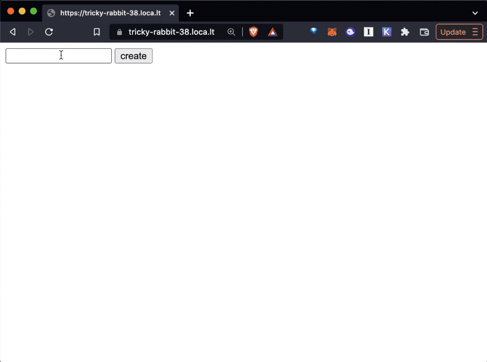

# Cell Tutorial

This document explains the Cell NFT Protocol and walks you through some tutorials to get you started in minutes.

> This tutorial assumes you have ZERO experience with blockchains or NFTs.
>
> As long as you know JavaScript and HTML, you should be able to follow along, deploy and mint NFTs.

1. **Concepts:** A quick overview of the Cell protocol stack
2. **Quickstart:** Follow the tutorial to launch your own NFT collection with simple JavaScript
3. **More Examples:** Even more tutorials with more examples
4. **More Info:** FAQ and links to API docs

---

# Concepts

Before we go in, here's a quick overview of the Cell framework stack.

## Cell

Cell is an NFT protocol. It is a new approach to creating and managing NFTs that is scalable, flexible, and completely removes trusted 3rd parties from the picture once and for all.

- **OWNERLESS**
  - No one owns the Cell protocol. No governance, no centralized upgrades. Every creator fully owns not just the contract, but also their entire UX. You don't have to use some company's service to make NFTs anymore. Cell is an **open public utility protocol**.
- **CREATE NFTS FOR FREE**
  - The only time you pay the gas fee is when you deploy the contract for the first time. From that point on, the creator gets to create as many tokens as they want for free. Only the minters pay gas for the minting.
- **NO TRUSTED 3RD PARTY**
  - Cell requires zero reliance on a trusted 3rd party to run. You don't **"join"** some website called "Cell" to create your tokens. Instead, think of it as an open source tool, just like Wordpress.

## Domain

**Cell NFTs can exist both onchain AND offchain.** When offchain tokens are recorded onto the blockchain through minting, they become "onchain tokens".

Tokens can ONLY be minted to the contracts they were created for. To enforce this, each token contains a piece of metadata made up of the following 3 attributes:

1. `address`: the contract address
2. `chainId`: the [chainId](https://chainlist.org/) used to describe the host blockchain (ex: 1 for Ethereum mainnet, 4 for Rinkeby)
3. `name`: the name of the contract specified when you deployed the NFT contract

**These 3 attributes are called a "domain" of a token.**

> When working with Cell NFT contracts, you will often need to provide the domain information to provide context around tokens.

Here's an example `domain`:

```json
{
  "address": "0x93f4f1e0dca38dd0d35305d57c601f829ee53b51",
  "chainId": 4,
  "name": "_test_"
}
```


## C0

`C0` is the first version (version 0) of the NFT contract for the Cell protocol. 

It can be deployed on any EVM compatible blocckhains. At the moment it is deployed on Ethereum:

- Mainnet: 
- Rinkeby: 

There may be more variations of the Cell protocol in the future.

## C0.js

`C0.js` is the JavaScript library that lets you:

1. **Create Tokens:** Create and sign tokens that can be eventually settled (minted) onto the `C0` contract on the blockchain.
2. **Mint Tokens:** Take the created tokens and post them to the `C0` contract on the blockchain.

## Nuron

Nuron is the software that lets you programmatically and automatically create tokens for the Cell protocol.

So why is Nuron needed?

1. **Automated tokenization:** To create an NFT collection with lots of tokens, we need a programmatic way to sign tokens. Nobody wants to sit there and manually sign 10,000 Metamask popups to create individual tokens. This is especially the case when we have a powerful protocol that lets you program each token individually, each with its own distinct logic. Cell is such a protocol, and to take advantage of all the features, we need an automated and flexible way to sign messages.
2. **IPFS that "just works":** One of the biggest hurdles when dealing with NFTs is IPFS. Everyone knows it's good to host NFT files on IPFS for provenance, but there isn't a simple way to manage and store files in a flexible way. For example, it's very tricky to manage IPFS files privately.

This is where "Nuron" comes in.

- **Wallet:** At the core of Nuron is a programmable wallet that can sign all kinds of messages automatically over RPC.
- **File System:** Additionally, Nuron includes a native file system that stores all the NFT related IPFS files locally as well as programmatically pin them to the global IPFS network whenever you want.
- **Database:** Finally, Nuron comes with a portable SQLite database that can store all your NFTs as well as their metadata, which is useful for sharing of pre-mint tokens WITHOUT relying on a trusted 3rd party.


## Nuron.js

Nuron.js is the JavaScript library that lets you programmatically interact with the Nuron software.

Because the Nuron interface is essentially an HTTP-based RPC endpoint, Nuron.js is an HTTP client that makes RPC requests to the local Nuron software and returns responses.

---

# Quickstart

Here are the next steps:

0. **Deploy contract:** Deploy the C0 contract.
1. **Setup nuron:** Install and setup Nuron, an app that lets you programmatically create and manage Cell NFTs.
2. **Create tokens:** Learn to use nuron.js to make requests to Nuron to create tokens.
3. **Manage tokens:** learn how the nuron file system stores and lets you browse and manage tokens.
4. **Mint tokens:** Learn how to publish the tokens and the built-in minting website, and mint from it./li>


---

## 0. Preparatioin

As the NFT creator, **the ONLY time you need to interact with the blockchain (and therefore need some coins) is WHEN YOU DEPLOY A CONTRACT.**

For deployment you need:

1. A wallet
2. Some coins

Let's take care of these first.

---

### 0.1. Get Wallet

You can use various wallets to deploy your contract, but let's use Metamask here since it's the most widely used:

<a class='btn' href="https://metamask.io/" target="_blank"> Go to Metamask Download</a>

---

### 0.2. Get Testnet Coins


In this tutorial we will launch the collection on Rinkeby, an Ethereum testnet. Let's get some testnet coins. 

Go to the following faucets to get Rinkeby coins for free:

1. https://faucets.chain.link/rinkeby
2. https://rinkebyfaucet.com/

---


## 1. Deploy Contract

### 1.1. Login to testnet account

Change your wallet network to Rinkeby and go to https://c0.cell.computer

You will see a website that looks like this:


Make sure that:

1. The top right corner says "Rinkeby"
2. You see the list of addresses

---

### 1.2. Cell computer home directory

Cell is a protocol but also a virtual computer. Just like most operating systems have a file system where all the files are stored under your home directory, Cell has a similar abstraction. The top most folder is the home directory.

The top row displays your **home** directory, which represents the currently logged-in blockchain (chainId) and the currently logged-in account (your address)


---

### 1.3. Contracts as subfolders

So what do the rest of the addresses represent?

The subfolders right below the home directory are your contracts. When you deploy your contracts, they will each be deployed at these addresses. This means you know the addresses of your contract even before you deploy them!


---

### 1.4. Deploy a contract

Now let's deploy one of the folders (contracts). 

Since all the folders are displayed upfront you can technically deploy any of them at any time.

However it is recommended that you **deploy them in order from the #0, to #1, to #2, in an incremental manner.** Otherwise it will be hard to keep track of which contracts you have deployed.

**Click the first row (contract #0)** to open the first folder (contract), and then enter the `name` and the `symbol` to deploy to the blockchain.

- `name`: The NFT collection name (The name that represents the collection, which will be displayed on NFT marketplaces and other platforms)
- `symbol`: The NFT collection symbol (not really used in case of NFTs so you can use anything)


Once the deployment transaction goes through, you will see the following screen where it displays [the domain of the deployed contract](#domain). Now we're ready to start printing some NFTs!:


---

## 2. Download Nuron

Nuron is a piece of software that lets you automatically and programmatically create tokens on any machine through an RPC interface.

---

### 2.1. Mac

Download on Mac:

<a class='btn' href="https://github.com/cell-org/nutron/releases/download/v0.0.1/nuron-0.0.1.dmg"><i class="fa-brands fa-apple"></i> Mac Installer</a>

---

### 2.2. Windows

Download on Windows:

<a class='btn' href="https://github.com/cell-org/nutron/releases/download/v0.0.1/nuron.Setup.0.0.1.exe"><i class="fa-brands fa-windows"></i> Windows Installer</a>

---

### 2.3. Linux

On Linux, we recommend using Docker to run Nuron. You need to install both [Docker](https://docs.docker.com/engine/install/) and [Docker Compose](https://docs.docker.com/compose/)

> You can also use the docker approach on Mac and Windows but for desktop settings it's much easier to just download the desktop apps.

#### A. Install Docker

First, install Docker by running the following commands ([Learn more](https://docs.docker.com/engine/install/ubuntu/#install-using-the-convenience-script))

```
curl -fsSL https://get.docker.com -o get-docker.sh
sudo sh get-docker.sh
```


#### B. Install Docker Compose

Next, install Docker Compose by running the following commands ([Learn more](https://docs.docker.com/compose/install/)):

```
sudo curl -L "https://github.com/docker/compose/releases/download/1.29.2/docker-compose-$(uname -s)-$(uname -m)" -o /usr/local/bin/docker-compose
sudo chmod +x /usr/local/bin/docker-compose
```

After the installation, check to make sure it's correctly installed:

```
docker-compose --version
```

It should print the current version.


#### C. Install and Run Nuron

To download and start Nuron, open the terminal and run the following command:

```
npx nuron start
```

This will automatically pull the docker image and start a container. run the following command to check that the container is running:

```
docker ps
```

You are all set to go if you see a Nuron container running:


---

## 3. Configure Nuron

You need to configure Nuron first. 

---

### 3.1. Mac & Windows

Open the Nuron app and you will see the following login screen:


#### Importing a Wallet

Currently there's no wallet connected to Nuron, so you will need to import a seed phrase.

> You must import **the wallet you used to deploy the Cell contract**.

Click "import a wallet" and you will see the following "import" page:


You can export your wallet seed phrase from other wallets (Example: [Metamask](https://metamask.zendesk.com/hc/en-us/articles/360015290032-How-to-reveal-your-Secret-Recovery-Phrase)) and paste it here.

Make sure to enter an account name to remember the wallet as, and enter a pass phrase to encrypt the wallet. The encrypted wallet will be stored locally on your machine (For maximum security, **EVERYTHING IN NURON HAPPENS ON YOUR LOCAL MACHINE**).

When you finish, Nuron will log you in and send you to the home screen:


#### Connecting to IPFS

Nuron currently uses [nft.storage](https://nft.storage) to pin your NFT files for free.

First go to nft.storage, get an account, and create an API key:


Now come back to Nuron, click the gear icon at the top right corner to go to the settings page:


And then click the **"workspace settings"** to go to the IPFS settings page. The API Key field will be empty. Copy and paste your NFT.STORAGE API Key here.


Now you're all ready to go!

---


### 3.2. Linux

On Linux, instead of using the web UI you can use the **Nuron CLI** to configure Nuron. Run the following command to connect to and configure Nuron:

```
npx nuron config
```

Make sure to configure both of the following:

1. **Import a wallet:** You MUST use the same address that deployed this contract. Export the seed phrase from the wallet you used to deploy this collection, and import it into Nuron./li>
2. **Configure IPFS:** Set the [nft.storage](https://nft.storage) IPFS config

#### Import a wallet

First, import your wallet seed phrase (or generate a new wallet):


#### Configure IPFS

Next, sign up to [nft.storage](https://nft.storage), get an API KEY, and store it into Nuron:


---

## 4. Create Tokens

Once Nuron is running on your machine, we are now all ready to go.

> **Create vs. Mint**
>
> One of the most important distinguishing factors of Cell is that, "creating" a token and "minting" a token are separate steps.
>
> This unbundling makes the engine ultra-flexible.
>
> **Example 1:** A collection creator may create 1000 tokens and publish them on a website, and minters may come to the site and "mint" them later.
>
> **Example 2:** A minter may request a collection creator to "create" a custom token. When the creator creates and returns the signed token to the minter, the minter can then "mint" it to the blockchain.
>
> **Example 3:** A collection creator may create a token privately and give it to someone privately WITHOUT publishing anywhere (through social media DMs, emails, text messages, etc). The receiver can then mint the token when they want.

---

### 4.1. Preview

With Cell, all you need to know is JavaScript code. All the complicated details are taken care of by Nuron, including:

1. managing and publishing IPFS files
2. signing cryptographic messages to create tokens that can be minted on the blockchain
3. creating minting sites and storefront sites

In this example we will create a **100 item generative avatar NFT collection with nothing but JavaScript, complete with a default storefront page and a minting page.** 

The storefront landing page will look like this:


And the minting page for each token will look like this:


---

### 4.2. Get the domain

Cell lets you print NFTs that can be potentially minted to ANY blockchain. Because of this flexibility, you need to define every token with a [domain](#domain) in order to describe where the tokens can be minted to.

- **GET THE DOMAIN:** Go to your Cell dashboard at https://c0.cell.computer and get the domain JSON for your deployed contract.


> **IMPORTANT**
>
> THIS PART IS IMPORTANT!!!!!
>
> Every code example in this document uses a demo domain. If you try to use them it won't work.
>
> You must **use your own domain**.

---

### 4.3. Create NFTs with JavaScript


First install all dependencies:

```
npm install nuronjs @dicebear/open-peeps @dicebear/avatars
```

Then create a file named `index.js`:

```javascript
const DOMAIN = <PASTE YOUR DOMAIN JSON OBJECT HERE>
const { createAvatar } = require('@dicebear/avatars');
const style = require('@dicebear/open-peeps');
const Nuron = require('nuronjs')
const nuron = new Nuron({
  key: "m'/44'/60'/0'/0/0",
  workspace: "open-peeps",
  domain: DOMAIN
});
(async () => {

  ////////////////////////////////////////////////////
  //
  // 0. CLEAN UP WORKSPACE (OPTIONAL)
  // if you want to start from clean slate
  // every time you run this code, remove everything
  // from the file system and the DB first.
  //
  ////////////////////////////////////////////////////

  // 0.1. Remove all files from the workspace "fs" folder
  await nuron.fs.rm("*")

  // 0.2. Remove all items from the token table
  await nuron.db.rm("token", {})

  // Loop 42 times and make avatars
  for(let i=0; i<42; i++) {

    ////////////////////////////////////////////////////
    //
    // 1. CREATE FILES (SVG + METADATA)
    //
    ////////////////////////////////////////////////////

    // 1.1. Generate the Avatar SVG
    let svg = createAvatar(style, { seed: i.toString() });

    // 1.2. Write the SVG to the file system
    let svg_cid = await nuron.fs.write(Buffer.from(svg))

    // 1.3. Write the NFT metadata to the file system
    let metadata_cid = await nuron.fs.write({
      name: `${i}`,
      description: `${i}.svg`,
      image: `ipfs://${svg_cid}`,
      mime: { [svg_cid]: "image/svg+xml" }  // to render the SVG with the correct mime type in the frontend
    })

    ////////////////////////////////////////////////////
    //
    // 2. CREATE A TOKEN AND WRITE TO NURON
    //
    ////////////////////////////////////////////////////

    // 2.1. Create a token from the metadata cid
    let token = await nuron.token.create({
      cid: metadata_cid
    })

    // 2.2. Write the token to the DB ("token" table)
    await nuron.db.write("token", token)

    // 2.3. Write the token to the file system
    await nuron.fs.write(token)

    ////////////////////////////////////////////////////
    //
    // 3. PIN ALL THE FILES (SVG + METADATA)
    //
    ////////////////////////////////////////////////////

    await nuron.fs.pin(svg_cid)
    await nuron.fs.pin(metadata_cid)

    console.log(`[${i}] created token`, token)
  }

  ////////////////////////////////////////////////////////////////
  //
  // 4. BUILD A BASIC COLLECTION WEBSITE (index.html + token.html)
  //
  ////////////////////////////////////////////////////////////////
  await nuron.web.build()
  console.log("finished")
})();
```

Run the code:

```
node index
```

Above code takes care of everything you need for an NFT collection, including:

1. Store files locally
2. Create tokens locally
3. Publish all the files to the global IPFS network (pinning)

All that's left now is to to publish the tokens to the web so people can mint them.

> To learn how to actually publish the NFTs and the storefront website, skip to the next section "Browse and Manage Tokens"

---

## 5. Manage Tokens

Any signed token can be submitted to the blockchain to be minted. To mint tokens, we will use `c0.js`, a library that lets you interact with the Cell C0 contract on the blockchain.

---

### 5.1. Where is everything stored?

So where are all the files stored? Run the following command to find out:

```
npx nuron home
```

Open the folder with Finder (mac) or Explorer (windows) or ls (linux) and you will see all the files you've just created.


```
<YOUR_HOME_DIRECTORY>
│
└── __nuron__
    └── v0
        └── home
            ├── config.json
            └── workspace
                │
                ├── <WORKSPACE 1>
                │   ├── db
                │   │   └── mixtape.db
                │   ├── fs
                │   │   ├── <IPFS file 0>
                │   │   ├── <IPFS file 1>
                │   │   ├── <IPFS file 2>
                │   │   ├── . . .
                │   │   └── <IPFS file n>
                │   └── web
                │       ├── index.html
                │       └── token.html
                │
                └── <WORKSPACE 2>
                    ├── db
                    │   └── mixtape.db
                    ├── fs
                    │   ├── <IPFS file 0>
                    │   ├── <IPFS file 1>
                    │   ├── <IPFS file 2>
                    │   ├── . . .
                    │   └── <IPFS file n>
                    └── web
                        ├── index.html
                        └── token.html
```

- `db`: the db folder
  - `db/mixtape.db`: stores all the token JSON in sqlite, so they can be queried in realtime, but also shared easily in a single file
- `fs`: the fs folder stores all the files (including the asset files, metadata files, and even the token files) under the IPFS names WITHOUT publishing anything to the global IPFS network. You will need to pin these files to IPFS if you want them to be public at some point.
- `web`: the website folder
  - `index.html`: the main page that displays all the tokens under the folder. It loads the `mixtape.db` database once when the page loads, and queries the in-browser DB to load tokens and render them.
  - `token.html`: the page used to render and mint the tokens.

---

### 5.2. Mac & Windows

On Mac and Windows, the Nuron app lets you navigate the Nuron file system, as well as acting as a built-in local web server that lets you easily preview the generated NFT website easily.

#### Navigating Workspaces

A "workspace" is just a local folder.

- You can create as many workspaces as you want.
- You can even create multiple workspaces for one contract.
- The workspace name is 100% local and it's only for your organization purpose. You can name them whatever you want, the workspace name won't show up on chain.

To navigate your workspaces:

1. Login to Nuron. Select `workspaces`.
2. You will see all your workspaces here (it will be empty if you didn't create one yet. you can programmatically create workspaces by following the tutorial example above)
3. Select the workspace you want to navigate and click around.


#### Previewing Websites

If you generated the website using the `nuron.web.build()` command, you will see a `web` folder in your workspace. (This is optional, so if you didn't generate a website, you won't see the web folder).

Nuron has a built-in web server that lets you preview these sites easily.

1. From Nuron, go to the `web` folder in your workspace. You will see `index.html` and `token.html`
3. Open the `index.html` file. It will open your default browser and load the `index.html` file in it.


---

### 5.3. Linux

#### Navigating Workspaces

In Linux we are going to use the terminal to navigate and preview these files.

Let's first check which workspaces the Nuron file system contains. From your terminal, enter the following command:

```
npx nuron ls
```

It will print all the workspaces created so far (it will be empty if there are none).

Now let's actually go to the folder where all the files are stored. First find out the Nuron file system path:

```
npx nuron home
```

This will print the local folder where all the Nuron files are stored. Let's say the folder was `/Users/Alice/__nuron__/v0/home`, let's change directory:

```
cd /Users/Alice/__nuron__/v0/home
```

You will see there is a `config.json` file and a `workspace` folder. Go into the workspace folder:

```
cd workspace
```

This is where all the files are stored. Feel free to navigate them more to understand the folder structure.


#### Previewing Websites

Remember we called the `nuron.web.build()` method in the creation code? This was what created the `web/index.html` and `web/token.html` files.

1. `web/index.html`: creates the storefront homepage
2. `web/token.html`: creates the landing page that renders each token individually

> You don't have to use these auto-generated pages. They are just provided for convenience.


This will list all the folders. We want to start a local HTTP server for one of the folders, in this case `_test_`:


```
npx nuron serve _test_
```

This command internally uses HTTP-SERVER module to serve local files from a local web server. The terminal will look something like this:

```
Starting up http-server, serving /root/_nuron/home/fs/open-peeps

http-server version: 14.1.0

http-server settings:
CORS: disabled
Cache: 3600 seconds
Connection Timeout: 120 seconds
Directory Listings: visible
AutoIndex: visible
Serve GZIP Files: false
Serve Brotli Files: false
Default File Extension: none

Available on:
  http://127.0.0.1:8080
  http://165.22.187.55:8080
  http://10.10.0.15:8080
  http://172.17.0.1:8080
  http://172.28.0.1:8080
Hit CTRL-C to stop the server
```

Let's test now. Open the server URL in the browser (for this example it's http://127.0.0.1:8080/web), and you will see the storefront landing page.

For the generative avatar example, it will look something like this:


#### Testing Publicly (advanced)

The problem (or benefit, depending on what you're trying to do) with the local test is that **ONLY YOU can access the website**, since you're loading the website from your own local machine. No one else can just type in http://127.0.0.1:8080/web from their machines and access your website.

While testing, you may often want to have a temporary REAL URL that anyone else can access (such as https://fluffy-hound-53.loca.lt/), so you can privately test with your friends or colleagues. Some possible scenarios:

1. **Private sharing:** Quickly share the minting page with a small group of people who have the URL
2. **Test on a remote linux machine:** If you're running Nuron on a remote linux machine (like Digitalocean), you can't just type in http://127.0.0.1:8080/web in your browser to access the website because the http://127.0.0.1:8080/web on your machine is your own machine, not the remote linux machine.

To solve this problem, you can set up a temporary public URL that connects to the instant HTTP server you created with `nuron serve [folder]`. Just get the port number from the `nuron serve` (let's assume the port is 8080/web in this case) and run the following command, which creates a public URL "tunnel" that connects to the local IP:

```
npx nuron tunnel 8080
```

It will start a tunnel and print the public URL you can use, for example:

```
Tunnel created:  https://fluffy-hound-53.loca.lt
```

> Nuron makes use of the free [Localtunnel service](https://theboroer.github.io/localtunnel-www/) to handle tunneling.

---

## 6. Publishing the Minting Site

The Cell protocol has been carefully designed to remove centralization points. By default everything works as a static website, with no centralized database running somewhere in the cloud.

Everything is packaged in a way that should "just work". So how do we publish this thing and allow people to mint?

---

### 6.1. Find the local workspace folder

You can find the workspace folder by following the instructions in [this section](#navigating-workspaces-1).

The `npx` commands work identically on all platforms including Mac, Windows, and Linux.

---


### 6.2. Publish the folder to the web

1. **Basic:** Just dump the entire collection folder onto your web hosting provider, and it should just work. For example if everything is stored under /root/_nuron/home/fs/open-peeps, you simply copy and paste that entire open-peeps folder into whichever web hosting provider you use, and it should work instantly.
2. **GitHub Pages:** Every folder in the Nuron file system is a git repository, and was designed to work right out of the box with no additional configuration. You can publish your NFT collection to the web for free using GitHub pages. To use GitHub pages, you can:
    1. download [GitHub Desktop](https://desktop.github.com/) and login with your GitHub account
    2. Add your NFT collection folder (example: `/root/_nuron/home/fs/open-peeps`), commit, and publish to GitHub
    3. Go to GitHub and [turn on GitHub pages](https://docs.github.com/en/pages/getting-started-with-github-pages/configuring-a-publishing-source-for-your-github-pages-site) for your repository

---

## 7. Minting Tokens

Once you publish the tokens to a website, you're pretty much done. Anyone can now come and mint the tokens they have the permission to.

> With Cell, each token can be individually programmed to have different minting conditions and traits from one another, such as royalty, expiration time, start time, price, hash puzzle, membership, etc.

---

### 7.1. Mint from the storefront

The included `index.html` and `token.html` are enough to let people mint directly from the website. Before moving forward, try minting from the site.

---

### 7.2. c0.js

You need to use [c0.js](https://c0js.cell.computer) to interact with the Cell C0 contract. The built-in web pages (`index.html` and `token.html`) both make use of the `c0.js` library to achieve this as well.

To learn more about how to use `c0.js`, check out the documentation: https://c0js.cell.computer

---

## 8. Launch in production mode

So far we've used the testnet.

But it is very simple to deploy the exact same contract to the mainnet. Here's what you need to do:

---

### 8.1. Switch to mainnet

Switch your browser wallet to mainnet and refresh the Cell computer dashboard at https://c0.cell.computer

---

### 8.2. Check the mainnet connection

From the dashboard, check to make sure that the top right corner says "mainnet"


---

### 8.3. Deploy to mainnet

ollow the same steps as we did with the [testnet deployment](#_04-deploy-a-contract). Only this time, it will simply deploy the contract to the mainnet, and once it's deployed you'll see that the contract domain has a chainId of "1":


---

# More Examples

## 1. Turn web images into NFT

First install all dependencies:

```
npm install nuronjs axios
```

Then create a file named index.js:


```javascript
const DOMAIN = <PASTE YOUR DOMAIN JSON OBJECT HERE>
const Nuron = require('nuronjs');
const axios = require('axios');
const nuron = new Nuron({
  key: "m'/44'/60'/0'/0/0",
  workspace: "this_cat",
  domain: DOMAIN
});
(async () => {

  ////////////////////////////////////////////////////
  //
  // 0. CLEAN UP WORKSPACE (OPTIONAL)
  // if you want to start from clean slate
  // every time you run this code, remove everything
  // from the file system and the DB first.
  //
  ////////////////////////////////////////////////////

  // 0.1. Remove all files from the workspace "fs" folder
  await nuron.fs.rm("*")

  // 0.2. Remove all items from the token table
  await nuron.db.rm("token", {})

  let cids = []

  // creating 100 tokens
  for(let i=0; i<100; i++) {

    ////////////////////////////////////////////////////
    //
    // 1. FETCH A REMOTE IMAGE AND WRITE TO NURON
    //
    ////////////////////////////////////////////////////
    
    // 1.1. Fetch web image
    const image = await axios({ url: "https://thiscatdoesnotexist.com/", method: "GET", responseType: 'arraybuffer' }).then((r) => { return r.data })

    // 1.2. Write the image buffer to the file system
    const cid = await nuron.fs.write(image)

    // 1.3. Write a metadata object to the file system
    const metacid = await nuron.fs.write({
      name: i,
      description: i,
      image: "ipfs://" + cid,
    })

    ////////////////////////////////////////////////////
    //
    // 2. CREATE A TOKEN AND WRITE TO NURON
    //
    ////////////////////////////////////////////////////
    
    // 2.1. Create a token (PRICE 0)
    const token = await nuron.token.create({
      cid: metacid,
      price: 0
    })

    // 2.2. Write the token to the DB
    await nuron.db.write("token", token)

    // 2.3. Write the token to the file system
    const tokencid = await nuron.fs.write(token)

    // 2.4. Store all the IPFS CIDs in an array so we can pin them all later in bulk
    cids.push(cid)
    cids.push(metacid)
  }

  ////////////////////////////////////////////////////
  //
  // 3. PIN ALL THE FILES
  //
  ////////////////////////////////////////////////////

  for(let i=0; i<cids.length; i++) {
    let res = await nuron.fs.pin(cids[i])
    console.log("pinned", i, "of", cids.length, res)
  }

  ////////////////////////////////////////////////////////////////
  //
  // 4. BUILD A BASIC COLLECTION WEBSITE (index.html + token.html)
  //
  ////////////////////////////////////////////////////////////////
  await nuron.web.build();

})();
```

Run the code:

```
node index
```

Above code takes care of everything you need for an NFT collection, including:

1. Store files locally
2. Create tokens locally
3. Publish all the files to the global IPFS network (pinning)

All that's left now is to to publish the tokens to the web so people can mint them.

> To learn how to actually publish the NFTs and the storefront website, skip to the next section "Browse and Manage Tokens"

---

## 2. Turn your local folder into NFTs

First install all dependencies:

```
npm install nuronjs
```

Then create a file named index.js:


```javascript
const DOMAIN = <PASTE YOUR DOMAIN JSON OBJECT HERE>
const fs = require('fs')
const path = require('path')
const Nuron = require('nuronjs');
const nuron = new Nuron({
  key: "m'/44'/60'/0'/0/0",
  workspace: "tokenized_images",
  domain: DOMAIN
});
const tokenize = async (folder) => {

  ////////////////////////////////////////////////////
  //
  // 0. CLEAN UP WORKSPACE (OPTIONAL)
  // if you want to start from clean slate
  // every time you run this code, remove everything
  // from the file system and the DB first.
  //
  ////////////////////////////////////////////////////

  // 0.1. Remove all files from the workspace "fs" folder
  await nuron.fs.rm("*")

  // 0.2. Remove all items from the token table
  await nuron.db.rm("token", {})

  ////////////////////////////////////////////////////////////
  //
  // 1. READ ALL FILES IN THE FOLDER AND LOOP THROUGH THEM ALL
  //
  ////////////////////////////////////////////////////////////
  // get all files under the "folder" location
  const files = await fs.promises.readdir(folder)
  // loop through all the filenames
  for(let file of files) {

    ////////////////////////////////////////////////////////
    //
    // 2. READ ALL FILES IN THE FOLDER AND WRITE TO NURON
    //
    ////////////////////////////////////////////////////////

    // 2.1. Read a file
    const buf = await fs.promises.readFile(path.resolve(folder, file))

    // 2.2. Write the file buffer to nuron file system
    const cid = await nuron.fs.write(buf)

    // 2.3. Write an NFT metadata to the nuron file system
    const metacid = await nuron.fs.write({
      name: file,
      image: "ipfs://" + cid,
    })

    ////////////////////////////////////////////////////////
    //
    // 3. CREATE A TOKEN FROM THE METADATA IPFS CID
    //
    ////////////////////////////////////////////////////////

    // 3.1. Create a token
    const token = await nuron.token.create({
      cid: metacid,
      price: 0
    })

    // 3.2. Write the token to the nuron file system
    await nuron.fs.write(token)

    // 3.3. Write the token to the nuron DB "token" table
    await nuron.db.write("token", token)

    ////////////////////////////////////////////////////////////////
    //
    // 4. PIN ALL THE FILES (both the metadata and the original file
    //
    ////////////////////////////////////////////////////////////////

    // 4.1. Pin the original file
    await nuron.fs.pin(cid)

    // 4.2. Pin the metadata file
    await nuron.fs.pin(metacid)

  }
  ////////////////////////////////////////////////////////////////
  //
  // 5. BUILD A BASIC COLLECTION WEBSITE (index.html + token.html)
  //
  ////////////////////////////////////////////////////////////////
  await nuron.web.build();

}

// take the command line folder argument and tokenize all images under that folder
tokenize(process.argv[2])
```

Run the code:

```
node index [IMAGE_FOLDER_PATH]
```

Above code takes care of everything you need for an NFT collection, including:

1. Store files locally
2. Create tokens locally
3. Publish all the files to the global IPFS network (pinning)

All that's left now is to to publish the tokens to the web so people can mint them.

> To learn how to actually publish the NFTs and the storefront website, read the next section "Manage Tokens"

---

## 3. On-demand NFTs

This documentation mostly discussed how to create all tokens BEFOREHAND, and let people mint from the created tokens published to the web.

However, one of the biggest benefits of the Cell protocol approach is that the **creating and minting of a token are unbundled and exist as separate steps**, which means you can create tokens on one machine, and mint them on another machine. This lets us easiliy implement on-demand minting apps.

For example, let's say you wanted to build something like the [Canvas NFT](https://canvas.papercorp.org/), where the users can customize what they want to mint. You can achieve this by:

1. create a web app server (for example using [express.js](https://expressjs.com/))
2. let people do whatever they want on the frontend side, and send a POST request with a desired payload
3. your server side logic can call the `nuron.token.create()` to create custom tokens requested by the frontend
4. the server can then return the created token to the frontend as the request response
5. the user can then take that JSON (signed token object) and mint it.

Let's take the `open-peeps` generative avatar example from above, and turn it into an on-demand minting app.

First, create a new project folder and install all the dependencies:

```
npm install @dicebear/avatars @dicebear/open-peeps express nuronjs
```

Now create a file named `index.js`:

```javascript
const DOMAIN = <PASTE YOUR DOMAIN JSON OBJECT HERE>
const { createAvatar } = require('@dicebear/avatars');
const style = require('@dicebear/open-peeps');
const Nuron = require('nuronjs')
const express = require('express')
const nuron = new Nuron({
  key: "m'/44'/60'/0'/0/0",
  workspace: "open-peeps",
  domain: DOMAIN
});
const app = express()
app.use(express.urlencoded({ extended: true }))
app.use(express.json())
app.get("/", (req, res) => {
  res.sendFile(__dirname + "/index.html")
})
app.post("/create", async (req, res) => {

  // 1. generate svg
  let svg = createAvatar(style, { seed: req.body.seed });

  // 2. write the svg to the nuron file system and get its IPFS cid
  let svg_cid = await nuron.fs.write(Buffer.from(svg))

  // 3. write the metadata to the nuron file system and get its IPFS cid
  let metadata_cid = await nuron.fs.write({
    name: req.body.seed,
    description: `${req.body.seed}.svg`,
    image: `ipfs://${svg_cid}`,
    mime: { [svg_cid]: "image/svg+xml" }
  })

  // 4. create a token from the metadata cid
  let token = await nuron.token.create({
    cid: metadata_cid
  })

  // 5. pin all the files (both svg and metadata)
  await nuron.fs.pin(svg_cid)
  await nuron.fs.pin(metadata_cid)

  // 6. return the created token as response. the user will take this token and mint it from the frontend
  res.json({
    token: token,
    svg: svg
  })
})
app.listen(3000)
```

Above code basically sets up an express.js server and when a `POST /create` request is made, it creates a token and returns it back to the frontend along with the SVG.

> **NOTE #1**
>
> Notice that in this example we are not using the `nuron.db.write()` method to store the tokens to the DB.
>
> This is because we are assuming that the user will receive the token as the request response from the frontend and **immediately mint it to the blockchain**.
>
> You only need to store to DB if you need some way to store all the tokens so they can be minted later.

> **NOTE #2**
>
> Even though we're not using the nuron DB in this example, we still need to use the **file system** by writing to it with the `nuron.fs.write()` API, because only then you can pin the nuron files to the public IPFS network using `nuron.fs.pin()`

Now we need the frontend page. Create a file named `index.html` in the same folder:


```html
<html>
<head>
<script src="https://cdnjs.cloudflare.com/ajax/libs/web3/1.7.1-rc.0/web3.min.js"></script>
<script src="https://unpkg.com/c0js/dist/c0.js"></script>
</head>
<body>
<form>
<input type='text' id='seed'>
<input type='submit' value='create'>
</form>
<div id='svg'></div>
<div id='tokens'>
</div>
<script>
document.querySelector("form").addEventListener("submit", async (e) => {
  e.preventDefault()
  e.stopPropagation()
  // initialize c0 with the browser web3 instance
  const web3 = new Web3(window.ethereum);
  const c0 = new C0()
  await c0.init({ web3: web3 })
  // call "POST /create" endpoint to generate a token
  let response = await fetch("/create", {
    method: "POST",
    headers: { "Content-Type": "application/json" },
    body: JSON.stringify({ seed: document.querySelector("#seed").value })
  }).then((res) => {
    return res.json()
  })
  let svg = response.svg
  let token = response.token
  document.querySelector("#svg").innerHTML = svg
  // create a mint transaction with one token
  let tx = await c0.token.send([token])
  let address = token.domain.verifyingContract
  let tokenId = token.body.id
  if (token.domain.chainId == 4) {
    // rinkeby
    document.querySelector("#tokens").innerHTML = `<div class='markets'>
  <a href="https://testnets.opensea.io/assets/${address}/${tokenId}">Opensea</a>
  <a href="https://rinkeby.rarible.com/token/${address}:${tokenId}">Rarible</a>
</div>`
  } else {
    // mainnet
    document.querySelector("#tokens").innerHTML = `<div class='markets'>
  <a href="https://opensea.io/assets/${address}/${tokenId}">Opensea</a>
  <a href="https://rarible.com/token/${address}:${tokenId}">Rarible</a>
</div>`
  }
})
</script>
</body>
</html>
```

Now start the server and go to http://localhost:3000:

```
node index
```

The entire minting app will look something like this:





---


## 4. On-demand NFTs in Production

When you implement an on-demand NFT server, your server is basically acting as a token printer:

1. Users ask the token printer to print some tokens
2. Users take the printed token and mint it to the blockchain
3. Now the tokens are on-chain and your token printer's job is done

You as the token printer's job is ONLY to print tokens so they can be minted on chain. From that point on, the tokens follow the rule of the host blockchain and you are no longer needed (you are not the central point of failure).

This means that the only part where things may fail is your token printing step. If the token printer server shuts down or crashes, the users won't be able to ask your printer to give them tokens to mint.

To avoid this situation, you should program your on-demand token server so that it automatically restarts when something goes wrong and it crashes, so it always stays up.

There are two parts to this:

1. Nuron
2. Token Printer App

---

### 4.1. Nuron

The Nuron server itself is built resilient when packaged in the Docker container. Whenever Nuron crashes, it is programmed to automatically restart. 

This means **you don't have to worry about Nuron's resiliency. It just works.**

---

### 4.2. Token Printer App

While Nuron itself can automatically restart, we still have one issue.

Whenever Nuron restarts, it clears out all the connections, which means all the clients previously connected to Nuron will lose connection and they will need to re-connect.

To handle this, you can use the [nuron.js wallet.connect() API](https://nuronjs.cell.computer/#/?id=connect) to connect at the beginning of your token printer server initialization.

#### Initial Login

Let's quickly revisit the on-demand NFT express app from the previous section. Whenever we start this app, we can programmatically connect to Nuron using [nuron.wallet.connect()](https://nuronjs.cell.computer/#/?id=connect).

```javascript
const DOMAIN = <PASTE YOUR DOMAIN JSON OBJECT HERE>
const { createAvatar } = require('@dicebear/avatars');
const style = require('@dicebear/open-peeps');
const Nuron = require('nuronjs')
const express = require('express')
const nuron = new Nuron({
  key: "m'/44'/60'/0'/0/0",
  workspace: "open-peeps",
  domain: DOMAIN
});

////////////////////////////////////////////////
//
// CONNECT TO NURON USING THE
// WALLET USERNAME AND THE ENCRYPTION PASSWORD
// SET THROUGH "npx nuron config"!
//
////////////////////////////////////////////////
nuron.wallet.connect(WALLET_PASSWORD, WALLET_USERNAME)

...

```

By connecting at the beginning of your app's launch, you can esure that this app will connect to your desired Nuron account.

#### Reconnect on exception

Now that we know how to connect at the beginning, how do we make sure it's always connected? For example if Nuron crashes and restarts, or for some reason the connection is destroyed?

We can think about two different approaches:

1. **Handle exception:** handle exception in the app 
2. **Crash and restart:** just let the app crash, but run the app itself in a Docker container or in a process manager like [PM2](https://pm2.keymetrics.io/)

##### A. Handle exception in the app

For example, you

```javascript
const createToken = async (svg) => {
  try {
    // Try to write to nuron
    let svg_cid = await nuron.fs.write(Buffer.from(svg))
    . . .
  } catch (e) {
    // if it fails, try connecting to nuron and call createToken() again
    await nuron.wallet.connect(PASSWORD, USERNAME)
    await createToken(svg)
  }
}
```

##### B. Let the app crash and auto-restart on exception

Another approach is simply let the exception crash the app and let the app itself automatically restart. That way, the initial connection logic will kick in when the app restarts, and your app will be always connected.

To take this approach, you don't need to change the existing code. The code will simply crash when it tries to write to Nuron when the session has been disconnected. You just need to run the app itself in a way that can auto-restart. For example:

1. **Process manager:** run your node.js app in a process management engine like [PM2](https://pm2.keymetrics.io/)
2. **Container:** or containerize your app itself in a Docker container and run it with a `restart: always` policy


---

# More Info

## API Docs
 
- [nuron.js](https://nuronjs.cell.computer): Nuron RPC client for JavaScript. This is the core library for automatically creating tokens (without manual wallet signature approvals for every token) and an important part of the Cell framework.
- [nuron](https://nuron.cell.computer): Nuron RPC specification. You probably only need to read this if you're thinking of implementing your own Nuron client (using any programming language such as python, c, ruby, etc.)
- [c0.js](https://c0js.cell.computer): JavaScript library for interacting with the Cell C0 contract. C0.js lets you interact with the blockchain (Nuron.js is only for creating and managing stuff offchain), so you'll need to learn `c0.js` if you want to build actual minting interfaces.

---

## How do workspaces work?

1. You can create as many workspaces as you want for whatever purpose you want.
2. You can even create multiple different workspaces for the same contract, just to experiment.
3. When you initialize a Nuron object, you can specify which workspace you're going to be writing everything to for that session (example below).

```javascript
// This nuron instance will write to the folder "cube"
const nuron1 = new Nuron({
  key: "m'/44'/60'/0'/0/0",
  workspace: "cube",
  domain: {"address":"0x93f4f1e0dca38dd0d35305d57c601f829ee53b51","chainId":4,"name":"_test_"}
});

// This nuron instance will write to the folder "canvas"
const nuron2 = new Nuron({
  key: "m'/44'/60'/0'/0/0",
  workspace: "canvas",
  domain: {"address":"0x93f4f1e0dca38dd0d35305d57c601f829ee53b51","chainId":4,"name":"_test_"}
});
```

---

## Nuron commands

1. `npx nuron stop`: shut down nuron
2. `npx nuron ls`: list all folders in the nuron file system
3. `npx nuron serve [folder_name]`: start a local web server from the folder
4. `npx nuron tunnel [port]`: connect the local web server to a temporary public URL (to allow others to test privately)

